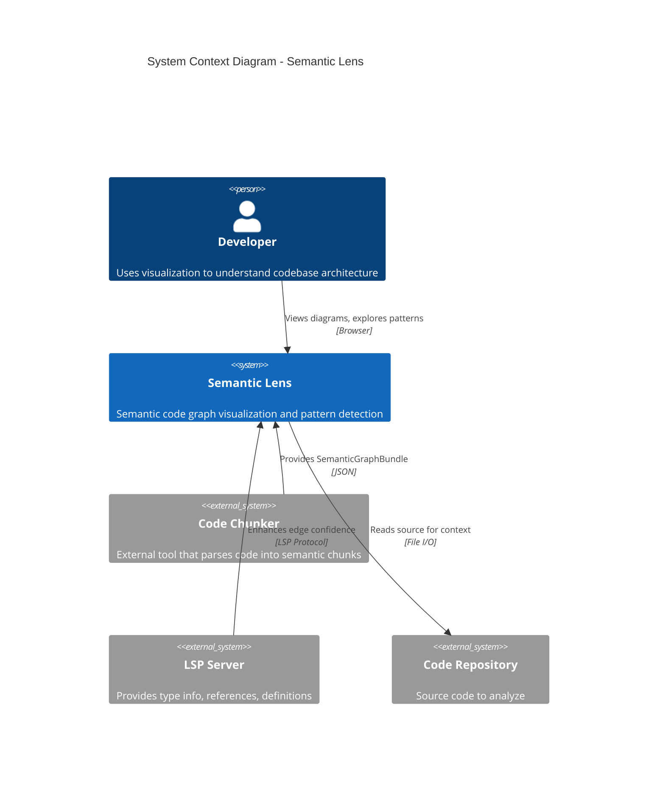
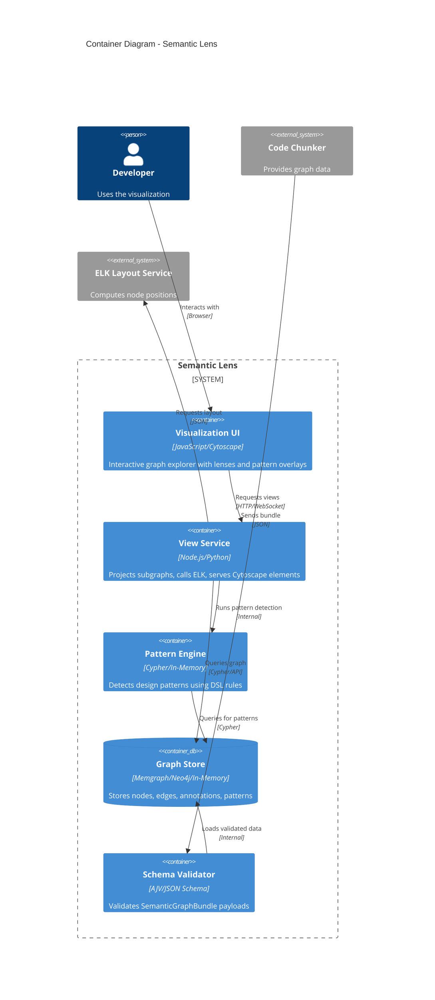
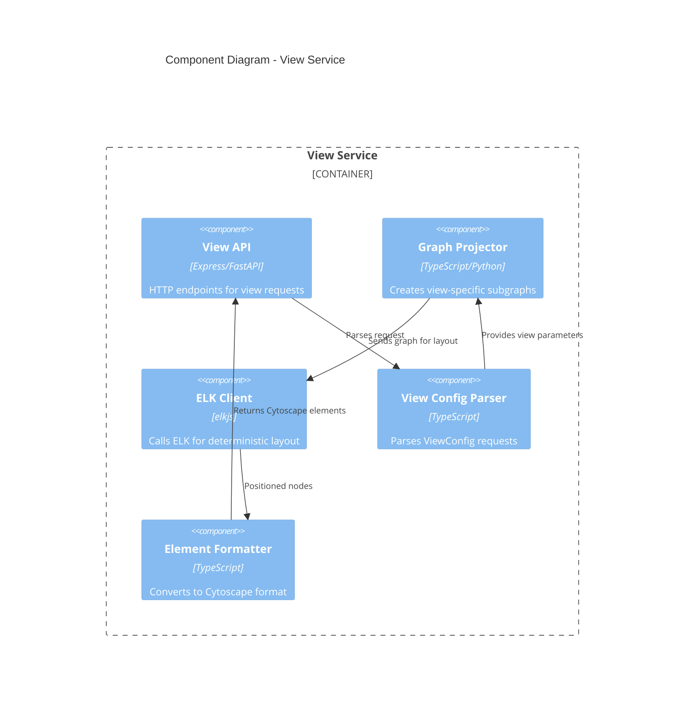
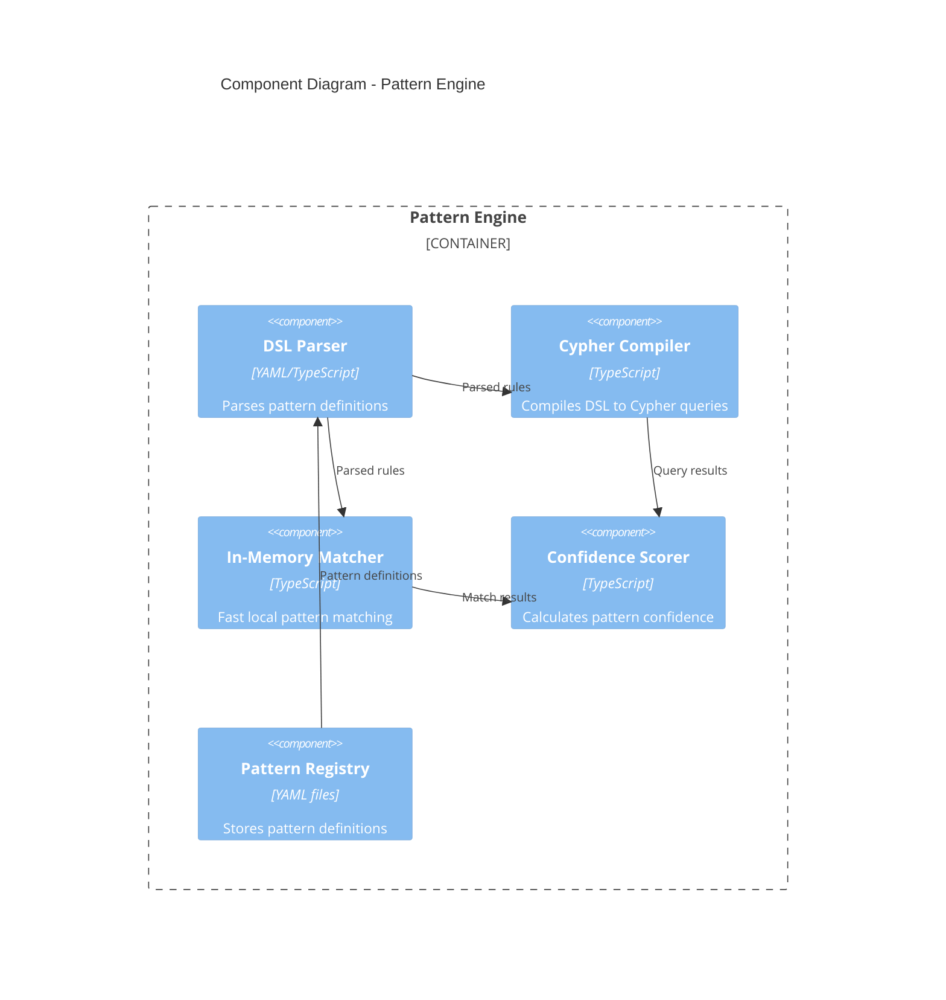
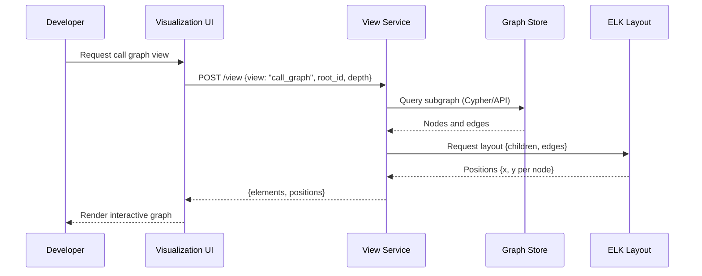
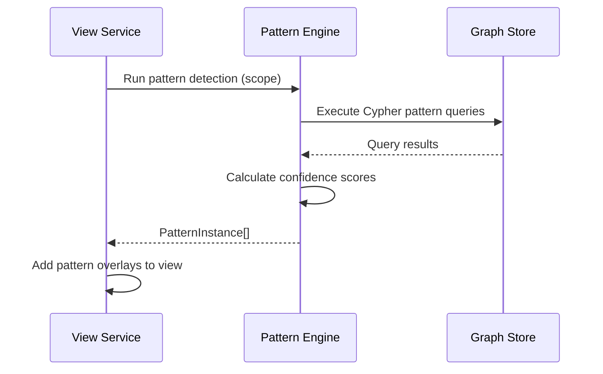
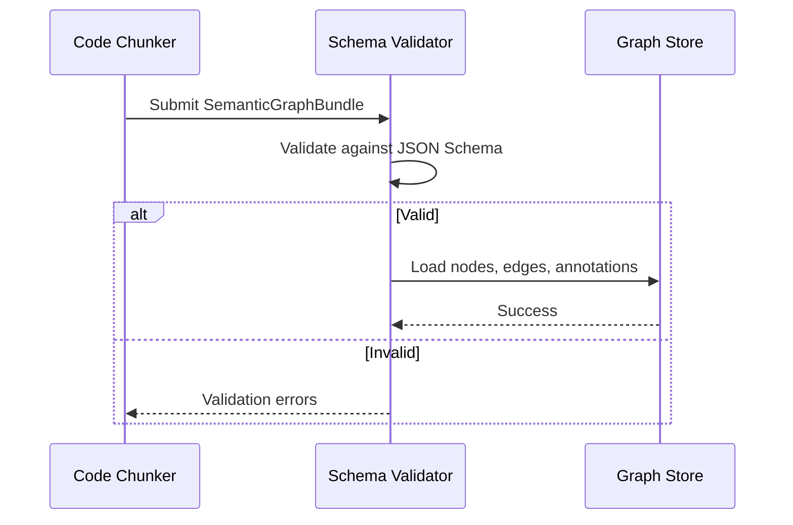

# CODEBASE Architecture Document

> **Project**: Semantic Lens
> **Generated**: 2026-01-01
> **Exploration Depth**: standard
> **Agent**: architecture-explorer
> **Status**: GREENFIELD PROJECT (Pre-Implementation)

## Executive Summary

Semantic Lens is a **greenfield project** for building a semantic code analysis and visualization platform. The system will analyze codebases to extract structural information (nodes: modules, classes, functions) and relationships (edges: calls, imports, inherits), then detect design patterns and render interactive graph visualizations.

The core technology stack will center on:

- **Graph data structures** with a formal JSON Schema (IR v1) for the semantic graph bundle
- **Pattern detection** via Cypher queries (Memgraph/Neo4j) or an in-memory matcher
- **Interactive visualization** using Cytoscape.js with ELK for deterministic layout

This is a developer tooling project aimed at providing architectural insights into codebases through semantic analysis and pattern recognition.

## Technology Stack (Planned)

### Languages

| Language              | Version | Usage                                                |
| --------------------- | ------- | ---------------------------------------------------- |
| TypeScript/JavaScript | Latest  | Primary - UI, graph visualization, view service      |
| Python                | 3.11+   | Optional - Pattern DSL compilation, analysis scripts |

### Frameworks

| Framework                   | Version | Purpose                         |
| --------------------------- | ------- | ------------------------------- |
| Cytoscape.js                | Latest  | Interactive graph visualization |
| ELK (Eclipse Layout Kernel) | Latest  | Deterministic graph layout      |

### Key Dependencies (Planned)

| Dependency   | Version | Purpose                         |
| ------------ | ------- | ------------------------------- |
| Cytoscape.js | Latest  | Graph rendering and interaction |
| elkjs        | Latest  | Graph layout service            |
| ajv          | Latest  | JSON Schema validation          |

### Infrastructure

| Component         | Technology          | Purpose                                           |
| ----------------- | ------------------- | ------------------------------------------------- |
| Graph Database    | Memgraph/Neo4j      | Store nodes and edges, run Cypher pattern queries |
| View Service      | HTTP/IPC API        | Serve graph projections and layout                |
| Schema Validation | JSON Schema 2020-12 | Validate SemanticGraphBundle payloads             |

---

## C4 Model

### Level 1: System Context

Semantic Lens operates as a developer tool that processes codebase data from external chunkers/analyzers and provides interactive architectural visualizations.



**External Actors:**
| Actor | Type | Interaction |
|-------|------|-------------|
| Developer | User | Views and interacts with graph visualizations |
| Code Chunker | System | Provides initial node/edge data in SemanticGraphBundle format |
| LSP Server | System | Provides high-confidence type/reference data |
| Code Repository | System | Source files for context and incremental updates |

**System Boundaries:**

- **Inside**: Graph storage, pattern detection, view projection, layout, visualization
- **Outside**: Code parsing (chunker), type inference (LSP), source code storage

---

### Level 2: Container Diagram



**Container Inventory:**

| Container        | Technology     | Responsibility                               | Port/Entry          |
| ---------------- | -------------- | -------------------------------------------- | ------------------- |
| Visualization UI | Cytoscape.js   | Interactive graph display, user interactions | Browser (port 3000) |
| View Service     | Node.js        | Graph projection, ELK integration, API       | HTTP (port 8080)    |
| Pattern Engine   | Cypher/Python  | Pattern DSL compilation, detection           | Internal            |
| Graph Store      | Memgraph/Neo4j | Node/edge storage, Cypher queries            | Bolt (7687)         |
| Schema Validator | AJV            | Validate incoming SemanticGraphBundle        | Internal            |

---

### Level 3: Component Diagrams

#### View Service Components



**Component Details:**

| Component         | Location                     | Responsibility                   | Key Exports                                    |
| ----------------- | ---------------------------- | -------------------------------- | ---------------------------------------------- |
| View API          | `src/view-service/api`       | HTTP endpoint handlers           | `GET /views`, `POST /view`, `POST /layout/elk` |
| Graph Projector   | `src/view-service/projector` | Subgraph extraction with filters | `projectGraph(config)`                         |
| ELK Client        | `src/view-service/layout`    | ELK integration                  | `computeLayout(nodes, edges)`                  |
| Element Formatter | `src/view-service/formatter` | Cytoscape element conversion     | `toCytoscapeElements(graph)`                   |

#### Pattern Engine Components



**Component Details:**

| Component         | Location               | Responsibility           | Key Exports                            |
| ----------------- | ---------------------- | ------------------------ | -------------------------------------- |
| DSL Parser        | `src/patterns/parser`  | Parse YAML pattern DSL   | `parsePatternDef(yaml)`                |
| Cypher Compiler   | `src/patterns/cypher`  | DSL to Cypher conversion | `compileToQuery(pattern)`              |
| In-Memory Matcher | `src/patterns/matcher` | Fast local matching      | `matchPattern(graph, pattern)`         |
| Confidence Scorer | `src/patterns/scorer`  | Score calculation        | `calculateConfidence(matches)`         |
| Pattern Registry  | `patterns/`            | Pattern definitions      | Observer, Strategy, Factory, Singleton |

---

## Module Structure (Planned)

### Directory Layout

```
semantic-lens/
├── specs/                  # Specifications
│   └── plain_english_spec.md
├── src/
│   ├── schema/             # JSON Schema definitions and validation
│   │   ├── semantic-graph-bundle.schema.json
│   │   └── validator.ts
│   ├── graph/              # Graph storage and querying
│   │   ├── loader.ts       # Load SemanticGraphBundle into DB
│   │   ├── store.ts        # Graph store abstraction
│   │   └── queries.ts      # Common graph queries
│   ├── patterns/           # Pattern detection engine
│   │   ├── dsl/            # YAML DSL parser
│   │   ├── cypher/         # Cypher query compiler
│   │   ├── matcher/        # In-memory matcher
│   │   └── definitions/    # Pattern YAML files
│   ├── view-service/       # View projection and API
│   │   ├── api/            # HTTP endpoints
│   │   ├── projector/      # Subgraph projection
│   │   ├── layout/         # ELK integration
│   │   └── formatter/      # Cytoscape element formatting
│   └── ui/                 # Visualization frontend
│       ├── graph/          # Cytoscape wrapper
│       ├── controls/       # Lenses, filters, controls
│       └── overlays/       # Pattern overlays
├── patterns/               # Pattern definition YAML files
├── .claude/
│   └── architecture/       # This documentation
└── package.json
```

### Key Modules

#### `src/schema/`

- **Purpose**: Define and validate the SemanticGraphBundle JSON Schema
- **Exports**: Schema definition, validation function
- **Dependencies**: ajv
- **Consumers**: Graph loader

#### `src/graph/`

- **Purpose**: Load, store, and query the semantic graph
- **Exports**: `loadBundle()`, `GraphStore`, graph queries
- **Dependencies**: Memgraph/Neo4j driver or in-memory store
- **Consumers**: View service, pattern engine

#### `src/patterns/`

- **Purpose**: Detect design patterns in the graph
- **Exports**: Pattern matcher, Cypher compiler, pattern instances
- **Dependencies**: Graph store, pattern DSL
- **Consumers**: View service (pattern overlay)

#### `src/view-service/`

- **Purpose**: Serve graph projections with layout
- **Exports**: HTTP API, view projector, Cytoscape elements
- **Dependencies**: Graph store, ELK, pattern engine
- **Consumers**: UI

---

## Data Flow

### Primary User Flow: View Graph



### Pattern Detection Flow



### Data Ingestion Flow



### Key Data Flows

| Flow               | Trigger                         | Path                                           | Data                                            |
| ------------------ | ------------------------------- | ---------------------------------------------- | ----------------------------------------------- |
| Load Bundle        | External chunker                | Chunker -> Validator -> Graph Store            | SemanticGraphBundle (nodes, edges, annotations) |
| View Request       | User interaction                | UI -> View Service -> Graph Store -> ELK -> UI | ViewConfig -> Cytoscape Elements                |
| Pattern Detection  | View render or explicit request | View Service -> Pattern Engine -> Graph Store  | PatternInstance[]                               |
| Incremental Update | Code change                     | Chunker -> Validator -> Graph Store (delta)    | Modified nodes/edges                            |

---

## Architectural Patterns

### Patterns to Implement

| Pattern            | Where Applied  | Evidence                                             |
| ------------------ | -------------- | ---------------------------------------------------- |
| Repository Pattern | Graph Store    | Abstraction over Memgraph/Neo4j/in-memory            |
| Strategy Pattern   | Pattern Engine | Multiple matcher implementations (Cypher, in-memory) |
| Observer Pattern   | UI             | React to graph/view state changes                    |
| Factory Method     | View Service   | Create different view types                          |

### Pattern Details

#### Graph Store Repository

- **Description**: Abstract graph storage behind interface
- **Implementation**: `GraphStore` interface with `MemgraphStore`, `InMemoryStore` implementations
- **Rationale**: Allow switching between embedded (client-side) and external (server) storage

#### Pattern Matcher Strategy

- **Description**: Swappable pattern matching implementations
- **Implementation**: `PatternMatcher` interface with `CypherMatcher`, `InMemoryMatcher`
- **Rationale**: Cypher for complex queries on DB, in-memory for fast client-side matching

---

## Interfaces & APIs

### External APIs (Planned)

| API                  | Type | Authentication | Documentation                          |
| -------------------- | ---- | -------------- | -------------------------------------- |
| `GET /views`         | REST | None (local)   | Returns available view types           |
| `POST /view`         | REST | None (local)   | Returns Cytoscape elements + positions |
| `POST /layout/elk`   | REST | None (local)   | Raw ELK layout service                 |
| `POST /patterns/run` | REST | None (local)   | Detect patterns in scope               |

### Internal Interfaces

| Interface             | Location                    | Consumers                    |
| --------------------- | --------------------------- | ---------------------------- |
| `SemanticGraphBundle` | `src/schema/`               | Chunker, Loader              |
| `GraphStore`          | `src/graph/store.ts`        | View Service, Pattern Engine |
| `PatternMatcher`      | `src/patterns/matcher.ts`   | Pattern Engine               |
| `ViewConfig`          | `src/view-service/types.ts` | View Service API             |

### Key Type Definitions (from Spec)

```typescript
// Node kinds
type NodeKind =
  | 'module'
  | 'class'
  | 'interface'
  | 'trait'
  | 'function'
  | 'method'
  | 'field'
  | 'property';

// Edge kinds
type EdgeKind =
  | 'defines'
  | 'imports'
  | 'calls'
  | 'inherits'
  | 'implements'
  | 'uses'
  | 'reads'
  | 'writes'
  | 'throws';

// Evidence sources
type Evidence = 'chunker' | 'lsp' | 'static_analysis' | 'heuristic' | 'llm_score';

// Core node structure
interface Node {
  node_id: string; // From chunker
  kind: NodeKind;
  name: string;
  language: string;
  file: string;
  span: [number, number];
  parent?: string;
  route?: string; // e.g., "pkg.mod::Class::method"
  visibility?: 'public' | 'protected' | 'private' | 'unknown';
  signature?: string;
  doc_hash?: string;
}

// Core edge structure
interface Edge {
  edge_id: string; // Hash of (kind, src, dst, meta)
  kind: EdgeKind;
  src: string;
  dst: string;
  confidence: number; // 0.0 - 1.0
  evidence: Evidence[];
  meta?: Record<string, unknown>;
}

// Pattern instance
interface PatternInstance {
  instance_id: string;
  pattern_id: string;
  roles: Record<string, string>; // role_name -> node_id
  confidence: number;
  evidence: string[];
  explain?: string;
}
```

---

## Configuration

### Environment Variables (Planned)

| Variable            | Required | Default                 | Purpose                   |
| ------------------- | -------- | ----------------------- | ------------------------- |
| `GRAPH_DB_URI`      | No       | `bolt://localhost:7687` | Memgraph/Neo4j connection |
| `GRAPH_DB_USER`     | No       | `neo4j`                 | Database username         |
| `GRAPH_DB_PASSWORD` | No       | `""`                    | Database password         |
| `ELK_SERVICE_URL`   | No       | embedded                | External ELK service URL  |
| `PORT`              | No       | `8080`                  | View service HTTP port    |
| `UI_PORT`           | No       | `3000`                  | Frontend dev server port  |

### Configuration Files

| File                                | Purpose                       | Format |
| ----------------------------------- | ----------------------------- | ------ |
| `patterns/*.yaml`                   | Pattern definitions in DSL v1 | YAML   |
| `semantic-graph-bundle.schema.json` | JSON Schema for validation    | JSON   |
| `tsconfig.json`                     | TypeScript configuration      | JSON   |
| `package.json`                      | Dependencies and scripts      | JSON   |

---

## Entry Points

### Application Entry Points (Planned)

| Entry Point  | File                        | Purpose                       |
| ------------ | --------------------------- | ----------------------------- |
| View Service | `src/view-service/index.ts` | Start HTTP API server         |
| UI           | `src/ui/main.ts`            | Start visualization frontend  |
| CLI          | `src/cli/index.ts`          | Command-line graph operations |

### Build/Dev Scripts (Planned)

| Script   | Command            | Purpose                          |
| -------- | ------------------ | -------------------------------- |
| dev      | `npm run dev`      | Start dev server with hot reload |
| build    | `npm run build`    | Production build                 |
| test     | `npm run test`     | Run test suite                   |
| validate | `npm run validate` | Validate graph bundle            |
| patterns | `npm run patterns` | Run pattern detection            |

---

## Testing Structure (Planned)

### Test Organization

| Test Type   | Location             | Framework  |
| ----------- | -------------------- | ---------- |
| Unit        | `tests/unit/`        | Vitest     |
| Integration | `tests/integration/` | Vitest     |
| E2E         | `tests/e2e/`         | Playwright |

### Key Test Areas

- Schema validation (valid/invalid bundles)
- Pattern detection (known patterns in test graphs)
- View projection (correct subgraph extraction)
- ELK layout (deterministic positioning)
- UI interactions (expand/collapse, lenses)

---

## Implementation Roadmap (from Spec)

The specification defines this implementation order:

1. **Schema Validation**: Implement bundle -> JSON Schema validation
2. **DB Loader**: Build nodes + edges loader into Memgraph/Neo4j
3. **Pattern Rules**: Implement 3-5 patterns in DSL, compile to Cypher
4. **View Service**: Build projection + ELK + Cytoscape element service
5. **Pattern Overlay UI**: Add pattern visualization and confidence slider

---

## Identified Patterns & Anti-Patterns

### Strengths (from Spec Design)

| Strength           | Evidence                                    | Impact                                |
| ------------------ | ------------------------------------------- | ------------------------------------- |
| Formal JSON Schema | IR v1 spec with JSON Schema 2020-12         | Strong contract, validation           |
| Stable IDs         | `node_id` from chunker, `edge_id` from hash | Deterministic, incremental updates    |
| Confidence scoring | All edges have `confidence` + `evidence`    | Allows filtering, quality indication  |
| Multiple matchers  | Cypher + in-memory matcher option           | Flexibility for different deployments |

### Areas to Watch

| Concern                | Location          | Severity | Recommendation                               |
| ---------------------- | ----------------- | -------- | -------------------------------------------- |
| Graph DB dependency    | Pattern detection | Medium   | Ensure in-memory fallback works fully        |
| ELK performance        | Large graphs      | Medium   | Implement incremental layout (per component) |
| Pattern DSL complexity | Custom patterns   | Low      | Start with simple patterns, iterate          |

---

## Security Considerations

### Authentication/Authorization

- **Method**: Local-only initially (no auth)
- **Implementation**: For production, add API key or OAuth

### Sensitive Data

| Data Type         | Storage     | Protection                           |
| ----------------- | ----------- | ------------------------------------ |
| Source code paths | Graph store | Local only, no external transmission |
| API keys (future) | Environment | Not committed to repo                |

### Security Concerns

- Ensure SemanticGraphBundle validation prevents injection attacks in Cypher queries
- Sanitize file paths before display

---

## Performance Characteristics

### Known Considerations

| Area              | Concern                           | Mitigation                                      |
| ----------------- | --------------------------------- | ----------------------------------------------- |
| Large graphs      | Memory and render time            | View projections, pagination, virtual scrolling |
| Pattern detection | O(n^2) or worse for some patterns | Limit scope, confidence thresholds              |
| ELK layout        | Slow for large graphs             | Incremental layout per connected component      |

### Optimization Opportunities

- Pre-index nodes by `(kind, name_tokens, route_prefix)` for fast lookup
- Pre-index adjacency by `edge_kind`
- Cache view projections for common queries
- Incremental updates: only recompute affected subgraphs

---

## Next Steps

After reviewing this document:

1. **Start implementation**: Run `/ai-dev-kit:plan-roadmap` to generate phased implementation plan
2. **Phase planning**: Run `/ai-dev-kit:plan-phase specs/ROADMAP.md "Phase 1"` for detailed phase breakdown
3. **Review spec**: The full specification is at `specs/plain_english_spec.md`

---

## Appendix: Exploration Log

### Files Analyzed

- Total files: 1 (greenfield project)
- Key files examined: `specs/plain_english_spec.md`

### Tools Used

- File glob search
- Specification analysis

### Confidence Level

| Section            | Confidence | Notes                         |
| ------------------ | ---------- | ----------------------------- |
| Context Diagram    | High       | Clear from spec               |
| Container Diagram  | High       | Well-defined in spec          |
| Component Diagrams | Medium     | Derived from spec, may evolve |
| Data Flow          | High       | Explicitly defined in spec    |

---

_This document was generated by the architecture-explorer agent for a GREENFIELD PROJECT. It represents the planned architecture based on the specification. Implementation will refine these designs._
