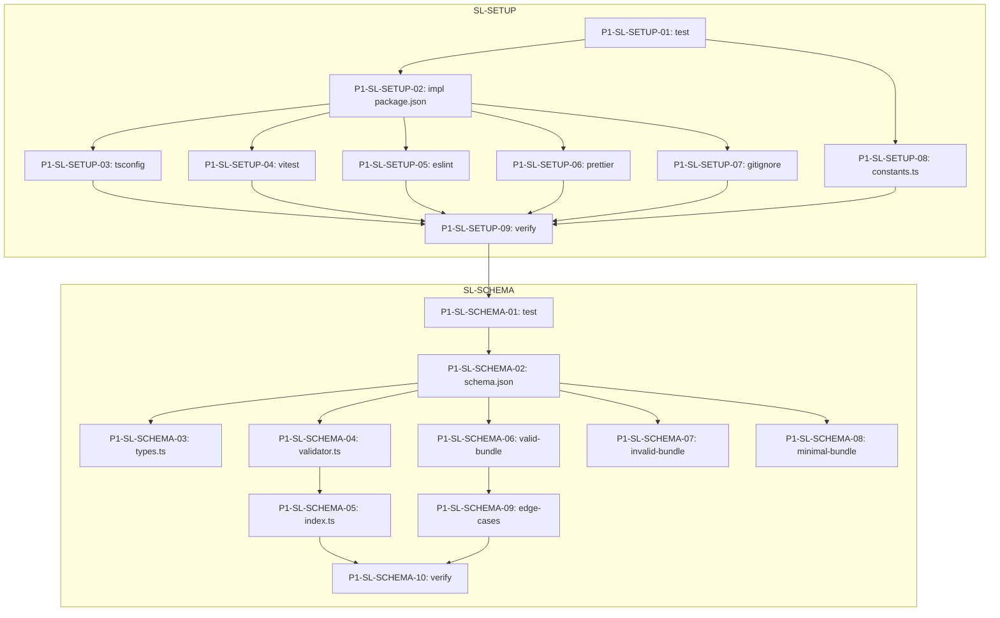

# P1: Foundation

> **Control Plane**: This phase plan is designed for execution via the **ai-dev-kit** plugin in Claude Code.
>
> - **Execute lanes**: `/ai-dev-kit:execute-lane plans/P1-foundation.md SL-SETUP`
> - **Execute phase**: `/ai-dev-kit:execute-phase plans/P1-foundation.md`
>
> For tasks better suited to other agents, use delegation:
> - **Large context analysis**: `/ai-dev-kit:delegate gemini "Review JSON Schema for edge cases"`
> - **Quick codegen**: `/ai-dev-kit:delegate cursor "Generate TypeScript type from schema"`
> - **Sandboxed execution**: `/ai-dev-kit:delegate codex "Run AJV validation tests"`

---

## Summary

Phase 1 establishes the foundational infrastructure for Semantic Lens:

- **Project Setup**: Initialize TypeScript project with modern tooling (ESLint, Prettier, Vitest)
- **JSON Schema**: Implement the SemanticGraphBundle schema (IR v1) for semantic graph data
- **Validation**: Create AJV-based validator with clear error messages
- **Type Generation**: Generate TypeScript types from JSON Schema
- **Test Fixtures**: Build valid/invalid bundle fixtures for testing

**Deliverables**:
1. `package.json` with all dependencies
2. `semantic-graph-bundle.schema.json` (JSON Schema 2020-12)
3. `src/schema/validator.ts` (AJV validation)
4. `src/schema/types.ts` (TypeScript types)
5. `src/constants.ts` (shared constants)
6. Test fixtures and unit tests with >80% coverage

---

## Interface Freeze Gates

### Core Interfaces (IF-0)
- [ ] IF-0-P1-SCHEMA: SemanticGraphBundle JSON Schema frozen
- [ ] IF-0-P1-TYPES: TypeScript types match JSON Schema exactly
- [ ] IF-0-P1-VALIDATOR: Validator interface and error format frozen

### Cross-Lane Dependencies
- [ ] IF-1-P1-SETUP: Project tooling configured and working
- [ ] IF-1-P1-CONSTANTS: Shared constants defined

---

## Lane Index & Dependencies

```
- SL-SETUP -- Project Setup and Tooling
  - Depends on: (none - foundation lane)
  - Blocks: SL-SCHEMA
  - Parallel-safe: yes

- SL-SCHEMA -- Schema, Validation, and Types
  - Depends on: IF-1-P1-SETUP, IF-1-P1-CONSTANTS
  - Blocks: (Phase 2)
  - Parallel-safe: yes
```

---

## A. Architectural Baseline & Component Catalog

### Files

| Path | Status | Owner | Purpose |
|------|--------|-------|---------|
| `package.json` | Added | SL-SETUP | Project manifest with dependencies |
| `tsconfig.json` | Added | SL-SETUP | TypeScript configuration |
| `vitest.config.ts` | Added | SL-SETUP | Test framework configuration |
| `.eslintrc.cjs` | Added | SL-SETUP | ESLint configuration |
| `.prettierrc` | Added | SL-SETUP | Prettier configuration |
| `src/constants.ts` | Added | SL-SETUP | Shared constants (NodeKind, EdgeKind, etc.) |
| `src/schema/semantic-graph-bundle.schema.json` | Added | SL-SCHEMA | JSON Schema 2020-12 definition |
| `src/schema/types.ts` | Added | SL-SCHEMA | TypeScript types from schema |
| `src/schema/validator.ts` | Added | SL-SCHEMA | AJV-based validation |
| `src/schema/index.ts` | Added | SL-SCHEMA | Module exports |
| `tests/unit/schema/validator.test.ts` | Added | SL-SCHEMA | Validator unit tests |
| `fixtures/valid-bundle.json` | Added | SL-SCHEMA | Valid test fixture |
| `fixtures/invalid-bundle.json` | Added | SL-SCHEMA | Invalid test fixture |
| `fixtures/minimal-bundle.json` | Added | SL-SCHEMA | Minimal valid bundle |

### Types

| Type | Path | Status | Description |
|------|------|--------|-------------|
| `NodeKind` | `src/constants.ts` | Added | Union of node kinds |
| `EdgeKind` | `src/constants.ts` | Added | Union of edge kinds |
| `Visibility` | `src/constants.ts` | Added | Node visibility levels |
| `Evidence` | `src/constants.ts` | Added | Evidence source types |
| `Span` | `src/schema/types.ts` | Added | `[start, end]` tuple |
| `Node` | `src/schema/types.ts` | Added | Graph node structure |
| `Edge` | `src/schema/types.ts` | Added | Graph edge structure |
| `Annotation` | `src/schema/types.ts` | Added | Node annotation structure |
| `PatternInstance` | `src/schema/types.ts` | Added | Pattern match structure |
| `SemanticGraphBundle` | `src/schema/types.ts` | Added | Top-level bundle type |
| `ValidationResult` | `src/schema/validator.ts` | Added | Validation result type |
| `ValidationError` | `src/schema/validator.ts` | Added | Error detail type |

### Functions

| Function | Path | Signature | Description |
|----------|------|-----------|-------------|
| `validateBundle` | `src/schema/validator.ts` | `(data: unknown) => ValidationResult` | Validates bundle against schema |
| `getValidator` | `src/schema/validator.ts` | `() => ValidateFunction` | Returns compiled AJV validator |
| `formatErrors` | `src/schema/validator.ts` | `(errors: ErrorObject[]) => ValidationError[]` | Formats AJV errors |

---

## B. Code-Level Interface Contracts

### IF-0-P1-SCHEMA: SemanticGraphBundle JSON Schema

**Defining File**: `src/schema/semantic-graph-bundle.schema.json`

```json
{
  "$schema": "https://json-schema.org/draft/2020-12/schema",
  "$id": "https://consiliency.dev/schemas/semantic-graph-bundle.schema.json",
  "title": "SemanticGraphBundle",
  "type": "object",
  "additionalProperties": false,
  "required": ["version", "generated_at", "nodes", "edges", "annotations", "patterns"],
  "properties": {
    "version": { "type": "string", "pattern": "^v\\d+\\.\\d+$" },
    "generated_at": { "type": "string", "format": "date-time" },
    "repo": { "$ref": "#/$defs/Repo" },
    "nodes": { "type": "array", "items": { "$ref": "#/$defs/Node" } },
    "edges": { "type": "array", "items": { "$ref": "#/$defs/Edge" } },
    "annotations": { "type": "array", "items": { "$ref": "#/$defs/Annotation" } },
    "patterns": { "type": "array", "items": { "$ref": "#/$defs/PatternInstance" } }
  }
}
```

**Consumers**: Graph loader (Phase 2), all downstream phases
**Freeze Condition**: Schema validated by AJV, types generated, tests pass

---

### IF-0-P1-TYPES: TypeScript Types

**Defining File**: `src/schema/types.ts`

```typescript
// Core types matching JSON Schema exactly
export interface SemanticGraphBundle {
  version: string;  // Pattern: ^v\d+\.\d+$
  generated_at: string;  // ISO 8601 date-time
  repo?: Repo;
  nodes: Node[];
  edges: Edge[];
  annotations: Annotation[];
  patterns: PatternInstance[];
}

export interface Node {
  node_id: string;  // minLength: 8
  kind: NodeKind;
  name: string;
  language: string;
  file: string;
  span: Span;  // [start, end]
  parent?: string;
  route?: string;
  visibility?: Visibility;
  signature?: string;
  doc_hash?: string;
}

export interface Edge {
  edge_id: string;  // minLength: 8
  kind: EdgeKind;
  src: string;
  dst: string;
  confidence: number;  // 0.0-1.0
  evidence: Evidence[];  // minItems: 1
  meta?: Record<string, unknown>;
}

export interface Annotation {
  target_id: string;
  tags: string[];
  kv?: Record<string, string | number | boolean | null>;
}

export interface PatternInstance {
  instance_id: string;
  pattern_id: string;
  roles: Record<string, string>;  // role_name -> node_id
  confidence: number;  // 0.0-1.0
  evidence: string[];
  explain?: string;
}
```

**Consumers**: All modules working with graph data
**Freeze Condition**: Types match schema 1:1, type tests pass

---

### IF-0-P1-VALIDATOR: Validator Interface

**Defining File**: `src/schema/validator.ts`

```typescript
export interface ValidationResult {
  valid: boolean;
  errors?: ValidationError[];
}

export interface ValidationError {
  path: string;       // JSON pointer path (e.g., "/nodes/0/kind")
  message: string;    // Human-readable error message
  keyword: string;    // JSON Schema keyword that failed
  params?: Record<string, unknown>;
}

// Main validation function
export function validateBundle(data: unknown): ValidationResult;

// Type guard for validated data
export function isValidBundle(data: unknown): data is SemanticGraphBundle;
```

**Consumers**: CLI (Phase 6), API endpoints (Phase 4)
**Freeze Condition**: Interface stable, error format finalized

---

## C. Exhaustive Change List

| File | Status | Owner | Rationale |
|------|--------|-------|-----------|
| `package.json` | Added | SL-SETUP | Dependencies: typescript, vitest, ajv, eslint, prettier |
| `tsconfig.json` | Added | SL-SETUP | ES2022 target, strict mode, path aliases |
| `vitest.config.ts` | Added | SL-SETUP | Test configuration with coverage |
| `.eslintrc.cjs` | Added | SL-SETUP | TypeScript ESLint rules |
| `.prettierrc` | Added | SL-SETUP | Consistent formatting |
| `.gitignore` | Added | SL-SETUP | Ignore node_modules, dist, coverage |
| `src/constants.ts` | Added | SL-SETUP | Shared type constants from spec |
| `src/schema/semantic-graph-bundle.schema.json` | Added | SL-SCHEMA | IR v1 schema from spec |
| `src/schema/types.ts` | Added | SL-SCHEMA | TypeScript types from schema |
| `src/schema/validator.ts` | Added | SL-SCHEMA | AJV validation with error formatting |
| `src/schema/index.ts` | Added | SL-SCHEMA | Public exports |
| `tests/unit/schema/validator.test.ts` | Added | SL-SCHEMA | Validation tests |
| `tests/unit/schema/types.test.ts` | Added | SL-SCHEMA | Type compatibility tests |
| `fixtures/valid-bundle.json` | Added | SL-SCHEMA | Complete valid bundle |
| `fixtures/invalid-bundle.json` | Added | SL-SCHEMA | Multiple validation errors |
| `fixtures/minimal-bundle.json` | Added | SL-SCHEMA | Minimal valid bundle |
| `fixtures/edge-cases/` | Added | SL-SCHEMA | Edge case fixtures |

---

## D. Swim Lanes

### SL-SETUP -- Project Setup and Tooling

**Scope**:
- Initialize TypeScript project with package.json
- Configure ESLint, Prettier, Vitest
- Create directory structure
- Define shared constants

**Owned Files**:
- `package.json`
- `tsconfig.json`
- `vitest.config.ts`
- `.eslintrc.cjs`
- `.prettierrc`
- `.gitignore`
- `src/constants.ts`

**Interfaces Provided**:
- `IF-1-P1-SETUP`: Project tooling ready
- `IF-1-P1-CONSTANTS`: `NODE_KINDS`, `EDGE_KINDS`, `EVIDENCE_TYPES`, `VISIBILITY` constants

**Interfaces Consumed**:
- None (foundation lane)

**Tasks**:

| Task ID | Task Type | Depends On | Files in Scope | Tests Owned Files | Test Command(s) | Acceptance Criteria |
|---------|-----------|------------|----------------|-------------------|-----------------|---------------------|
| P1-SL-SETUP-01 | test | - | - | `tests/unit/constants.test.ts` | `npm run test -- tests/unit/constants.test.ts` | Test file exists with constant validation |
| P1-SL-SETUP-02 | impl | P1-SL-SETUP-01 | `package.json` | - | `npm install` | Dependencies install without errors |
| P1-SL-SETUP-03 | impl | P1-SL-SETUP-02 | `tsconfig.json` | - | `npx tsc --noEmit` | TypeScript compiles |
| P1-SL-SETUP-04 | impl | P1-SL-SETUP-02 | `vitest.config.ts` | - | `npm run test -- --run` | Vitest runs |
| P1-SL-SETUP-05 | impl | P1-SL-SETUP-02 | `.eslintrc.cjs` | - | `npm run lint` | ESLint passes |
| P1-SL-SETUP-06 | impl | P1-SL-SETUP-02 | `.prettierrc` | - | `npm run format:check` | Prettier passes |
| P1-SL-SETUP-07 | impl | P1-SL-SETUP-02 | `.gitignore` | - | - | Ignores node_modules, dist |
| P1-SL-SETUP-08 | impl | P1-SL-SETUP-01 | `src/constants.ts` | `tests/unit/constants.test.ts` | `npm run test -- tests/unit/constants.test.ts` | Constants match spec |
| P1-SL-SETUP-09 | verify | P1-SL-SETUP-08 | - | - | `npm run build && npm run lint && npm run test` | All checks pass |

---

### SL-SCHEMA -- Schema, Validation, and Types

**Scope**:
- Implement JSON Schema for SemanticGraphBundle
- Create AJV-based validator with error formatting
- Generate TypeScript types matching schema
- Build test fixtures

**Owned Files**:
- `src/schema/semantic-graph-bundle.schema.json`
- `src/schema/types.ts`
- `src/schema/validator.ts`
- `src/schema/index.ts`
- `tests/unit/schema/*.test.ts`
- `fixtures/*.json`
- `fixtures/edge-cases/*.json`

**Interfaces Provided**:
- `IF-0-P1-SCHEMA`: JSON Schema definition
- `IF-0-P1-TYPES`: TypeScript types
- `IF-0-P1-VALIDATOR`: Validation function and result types

**Interfaces Consumed**:
- `IF-1-P1-SETUP`: Project tooling
- `IF-1-P1-CONSTANTS`: NodeKind, EdgeKind, etc.

**Tasks**:

| Task ID | Task Type | Depends On | Files in Scope | Tests Owned Files | Test Command(s) | Acceptance Criteria |
|---------|-----------|------------|----------------|-------------------|-----------------|---------------------|
| P1-SL-SCHEMA-01 | test | IF-1-P1-SETUP | - | `tests/unit/schema/validator.test.ts` | `npm run test -- tests/unit/schema/validator.test.ts` | Test file with validation cases |
| P1-SL-SCHEMA-02 | impl | P1-SL-SCHEMA-01 | `src/schema/semantic-graph-bundle.schema.json` | - | - | Schema matches spec exactly |
| P1-SL-SCHEMA-03 | impl | P1-SL-SCHEMA-02 | `src/schema/types.ts` | `tests/unit/schema/types.test.ts` | `npm run test -- tests/unit/schema/types.test.ts` | Types match schema |
| P1-SL-SCHEMA-04 | impl | P1-SL-SCHEMA-02, IF-1-P1-CONSTANTS | `src/schema/validator.ts` | `tests/unit/schema/validator.test.ts` | `npm run test -- tests/unit/schema/validator.test.ts` | Validator compiles schema, formats errors |
| P1-SL-SCHEMA-05 | impl | P1-SL-SCHEMA-04 | `src/schema/index.ts` | - | - | Exports all public API |
| P1-SL-SCHEMA-06 | impl | P1-SL-SCHEMA-02 | `fixtures/valid-bundle.json` | - | - | Valid bundle fixture |
| P1-SL-SCHEMA-07 | impl | P1-SL-SCHEMA-02 | `fixtures/invalid-bundle.json` | - | - | Invalid bundle with known errors |
| P1-SL-SCHEMA-08 | impl | P1-SL-SCHEMA-02 | `fixtures/minimal-bundle.json` | - | - | Minimal valid bundle |
| P1-SL-SCHEMA-09 | impl | P1-SL-SCHEMA-06 | `fixtures/edge-cases/*.json` | `tests/unit/schema/edge-cases.test.ts` | `npm run test -- tests/unit/schema/edge-cases.test.ts` | Edge case coverage |
| P1-SL-SCHEMA-10 | verify | P1-SL-SCHEMA-09 | - | - | `npm run test -- --coverage` | >80% coverage on schema module |

---

## E. Execution Notes

### Dependency Ordering



### Parallelization

- **SL-SETUP** tasks P1-SL-SETUP-03 through P1-SL-SETUP-07 can run in parallel after package.json
- **SL-SCHEMA** tasks P1-SL-SCHEMA-06 through P1-SL-SCHEMA-08 can run in parallel

### Serialization Points

1. `package.json` must complete before any other setup tasks
2. JSON Schema must complete before types or validator
3. All SL-SETUP tasks must complete before SL-SCHEMA starts

---

## F. File-by-File Specification

### `package.json` -- Added -- Owner: SL-SETUP

**Purpose**: Project manifest with dependencies and scripts

**Key Responsibilities**:
- Define dependencies: typescript, vitest, ajv, eslint, prettier
- Define scripts: build, test, lint, format

**Interfaces Exposed**: npm scripts

**Tests Required**: `npm install` succeeds

```json
{
  "name": "semantic-lens",
  "version": "0.1.0",
  "type": "module",
  "scripts": {
    "build": "tsc",
    "test": "vitest",
    "lint": "eslint src tests",
    "format": "prettier --write .",
    "format:check": "prettier --check .",
    "validate": "node dist/cli/validate.js"
  },
  "dependencies": {
    "ajv": "^8.12.0",
    "ajv-formats": "^2.1.1"
  },
  "devDependencies": {
    "@types/node": "^20.10.0",
    "typescript": "^5.3.0",
    "vitest": "^1.0.0",
    "@vitest/coverage-v8": "^1.0.0",
    "eslint": "^8.55.0",
    "@typescript-eslint/eslint-plugin": "^6.13.0",
    "@typescript-eslint/parser": "^6.13.0",
    "prettier": "^3.1.0"
  }
}
```

---

### `tsconfig.json` -- Added -- Owner: SL-SETUP

**Purpose**: TypeScript compiler configuration

**Key Responsibilities**:
- ES2022 target with strict mode
- Path aliases for clean imports
- Output to dist/

**Interfaces Exposed**: None (build config)

**Tests Required**: `tsc --noEmit` succeeds

---

### `vitest.config.ts` -- Added -- Owner: SL-SETUP

**Purpose**: Test framework configuration

**Key Responsibilities**:
- Configure test patterns
- Set coverage thresholds (80% for schema module)
- Configure path aliases

**Interfaces Exposed**: None (test config)

**Tests Required**: `vitest --run` succeeds

---

### `src/constants.ts` -- Added -- Owner: SL-SETUP

**Purpose**: Shared constants matching JSON Schema enums

**Key Responsibilities**:
- Export `NODE_KINDS`, `EDGE_KINDS`, `VISIBILITY`, `EVIDENCE_TYPES`
- Provide type unions from const arrays

**Interfaces Exposed**:
- `NodeKind`, `EdgeKind`, `Visibility`, `Evidence` types
- Constant arrays for runtime validation

**Tests Required**: `tests/unit/constants.test.ts`

```typescript
export const NODE_KINDS = ['module', 'class', 'interface', 'trait', 'function', 'method', 'field', 'property'] as const;
export type NodeKind = typeof NODE_KINDS[number];

export const EDGE_KINDS = ['defines', 'imports', 'calls', 'inherits', 'implements', 'uses', 'reads', 'writes', 'throws'] as const;
export type EdgeKind = typeof EDGE_KINDS[number];

export const VISIBILITY = ['public', 'protected', 'private', 'unknown'] as const;
export type Visibility = typeof VISIBILITY[number];

export const EVIDENCE_TYPES = ['chunker', 'lsp', 'static_analysis', 'heuristic', 'llm_score'] as const;
export type Evidence = typeof EVIDENCE_TYPES[number];
```

---

### `src/schema/semantic-graph-bundle.schema.json` -- Added -- Owner: SL-SCHEMA

**Purpose**: JSON Schema 2020-12 definition for SemanticGraphBundle

**Key Responsibilities**:
- Define complete bundle structure
- Include all node/edge/annotation/pattern definitions
- Enforce constraints (minLength, pattern, format)

**Interfaces Exposed**: JSON Schema for external validation

**Tests Required**: Schema parses with AJV

---

### `src/schema/types.ts` -- Added -- Owner: SL-SCHEMA

**Purpose**: TypeScript types matching JSON Schema exactly

**Key Responsibilities**:
- Define `SemanticGraphBundle`, `Node`, `Edge`, `Annotation`, `PatternInstance`
- Import and use types from `constants.ts`
- Provide type guards where useful

**Interfaces Exposed**: All graph data types

**Tests Required**: `tests/unit/schema/types.test.ts`

---

### `src/schema/validator.ts` -- Added -- Owner: SL-SCHEMA

**Purpose**: AJV-based validation with error formatting

**Key Responsibilities**:
- Compile JSON Schema with AJV
- Validate unknown data and return typed result
- Format errors with human-readable messages

**Interfaces Exposed**: `validateBundle()`, `isValidBundle()`, `ValidationResult`

**Tests Required**: `tests/unit/schema/validator.test.ts`

```typescript
import Ajv, { ErrorObject } from 'ajv';
import addFormats from 'ajv-formats';
import schema from './semantic-graph-bundle.schema.json';
import type { SemanticGraphBundle } from './types';

export interface ValidationResult {
  valid: boolean;
  errors?: ValidationError[];
}

export interface ValidationError {
  path: string;
  message: string;
  keyword: string;
  params?: Record<string, unknown>;
}

const ajv = new Ajv({ allErrors: true, strict: true });
addFormats(ajv);
const validate = ajv.compile(schema);

export function validateBundle(data: unknown): ValidationResult {
  const valid = validate(data);
  if (valid) {
    return { valid: true };
  }
  return {
    valid: false,
    errors: formatErrors(validate.errors ?? [])
  };
}

export function isValidBundle(data: unknown): data is SemanticGraphBundle {
  return validateBundle(data).valid;
}

function formatErrors(errors: ErrorObject[]): ValidationError[] {
  return errors.map(err => ({
    path: err.instancePath || '/',
    message: err.message ?? 'Unknown error',
    keyword: err.keyword,
    params: err.params
  }));
}
```

---

### `src/schema/index.ts` -- Added -- Owner: SL-SCHEMA

**Purpose**: Public exports for schema module

**Key Responsibilities**:
- Re-export types from `types.ts`
- Re-export validation functions from `validator.ts`

**Interfaces Exposed**: All public schema API

**Tests Required**: None (re-exports only)

---

### `fixtures/valid-bundle.json` -- Added -- Owner: SL-SCHEMA

**Purpose**: Complete valid bundle for testing

**Key Responsibilities**:
- Include all required fields
- Have at least 2 nodes, 1 edge, 1 annotation, 1 pattern
- Demonstrate realistic graph structure

**Interfaces Exposed**: Test fixture

**Tests Required**: Validates successfully

---

### `fixtures/invalid-bundle.json` -- Added -- Owner: SL-SCHEMA

**Purpose**: Invalid bundle with known errors

**Key Responsibilities**:
- Include multiple validation errors
- Cover different error types (missing field, wrong type, constraint violation)

**Interfaces Exposed**: Test fixture

**Tests Required**: Fails validation with expected errors

---

### `fixtures/minimal-bundle.json` -- Added -- Owner: SL-SCHEMA

**Purpose**: Minimal valid bundle

**Key Responsibilities**:
- Only required fields
- Empty arrays where allowed

**Interfaces Exposed**: Test fixture

**Tests Required**: Validates successfully

---

## H. Test Execution Plan

### Test Commands by Lane

**SL-SETUP**:
```bash
npm run test -- tests/unit/constants.test.ts
npm run lint
npm run format:check
npm run build
```

**SL-SCHEMA**:
```bash
npm run test -- tests/unit/schema/
npm run test -- tests/unit/schema/ --coverage
```

### Ordering Constraints

1. Run `npm install` before any tests
2. Run `npm run build` to verify compilation before coverage
3. Run coverage report last to verify thresholds

### Smoke Tests vs Full Suites

**Smoke Tests** (quick validation):
```bash
npm run build && npm run test -- --run tests/unit/schema/validator.test.ts
```

**Full Suite**:
```bash
npm run test -- --coverage
```

---

## J. Acceptance Criteria

| Criterion | Test Method | Pass Condition |
|-----------|-------------|----------------|
| `npm run build` compiles | `npm run build` | Exit code 0, no errors |
| TypeScript types match schema | `tests/unit/schema/types.test.ts` | All tests pass |
| Valid bundles validate | `tests/unit/schema/validator.test.ts` | `valid-bundle.json` passes |
| Invalid bundles fail | `tests/unit/schema/validator.test.ts` | `invalid-bundle.json` fails with correct errors |
| Error messages are clear | Manual review + test | Errors include path and human message |
| Coverage > 80% on schema | `npm run test -- --coverage` | schema/ module >= 80% |
| ESLint passes | `npm run lint` | Exit code 0 |
| Prettier passes | `npm run format:check` | Exit code 0 |
| Constants match spec | `tests/unit/constants.test.ts` | All enum values present |

---

## M. Output Validation Checklist

### Structure
- [x] Document has correct `# P1: Foundation` heading
- [x] All required sections (A through J) are present
- [x] Lane Index & Dependencies section is machine-parseable

### Gates
- [x] All interface contracts have `IF-*` gates
- [x] Gate IDs follow naming convention (IF-0-P1-*, IF-1-P1-*)

### Lanes
- [x] Each lane has unique ID (SL-SETUP, SL-SCHEMA)
- [x] Each lane has explicit file ownership
- [x] No unresolved file overlaps
- [x] Dependencies form a DAG (no cycles)

### Tasks
- [x] Each task has Task ID, Task Type, Depends On
- [x] Each task has Tests owned files and Test command(s)
- [x] Task ordering: test -> impl -> verify
- [x] No task modifies files outside its lane

### Acceptance Criteria
- [x] All criteria are testable (not subjective)
- [x] Each criterion maps to specific tests
- [x] No unverifiable criteria
