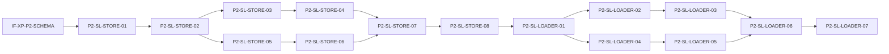

# P2: Graph Core

> **Control Plane**: This phase plan is designed for execution via the **ai-dev-kit** plugin.
> Use `/ai-dev-kit:execute-lane plans/P2-graph-core.md SL-STORE` to execute individual lanes.
> Use `/ai-dev-kit:execute-phase plans/P2-graph-core.md` to execute all lanes in dependency order.
>
> For specialized tasks, delegate to appropriate agents:
> - **Sandboxed execution**: `/ai-dev-kit:delegate codex "Build and test InMemoryStore"`
> - **Large context**: `/ai-dev-kit:delegate gemini "Review graph traversal edge cases"`

---

## Summary

Phase 2 implements the graph storage layer for Semantic Lens:

1. **GraphStore interface** - Abstract interface for graph operations
2. **InMemoryStore implementation** - Full-featured in-memory graph store
3. **MemgraphStore implementation** - Optional Memgraph/Neo4j backend
4. **Bundle loader** - Transform validated bundles into graph operations
5. **Query utilities** - Common graph queries (neighbors, paths, subgraphs)
6. **Indexing** - Fast lookups by kind, route, file

### What Ships

- `src/graph/store.ts` - GraphStore interface and types
- `src/graph/memory-store.ts` - InMemoryStore implementation
- `src/graph/memgraph-store.ts` - MemgraphStore implementation
- `src/graph/loader.ts` - Bundle loader with validation
- `src/graph/queries.ts` - Query utilities and helpers
- `src/graph/index.ts` - Public API exports
- Test suite with >80% coverage on graph module

---

## Interface Freeze Gates

### Core Interfaces (IF-0)

- [ ] IF-0-P2-STORE: GraphStore interface frozen (write/read/query/lifecycle operations)
- [ ] IF-0-P2-QUERY: NodeQuery and EdgeQuery criteria types frozen
- [ ] IF-0-P2-SUBGRAPH: SubgraphResult type frozen

### Cross-Phase Dependencies (IF-XP)

- [x] IF-XP-P2-SCHEMA: SemanticGraphBundle types from Phase 1 (frozen)
- [x] IF-XP-P2-CONSTANTS: NodeKind, EdgeKind from Phase 1 (frozen)
- [x] IF-XP-P2-VALIDATOR: validateBundle function from Phase 1 (frozen)

---

## Lane Index & Dependencies

```
- SL-STORE -- Graph Store Interface & InMemoryStore
  - Depends on: IF-XP-P2-SCHEMA, IF-XP-P2-CONSTANTS
  - Blocks: SL-LOADER
  - Parallel-safe: yes

- SL-LOADER -- Bundle Loader & Query Utilities
  - Depends on: IF-0-P2-STORE, SL-STORE, IF-XP-P2-VALIDATOR
  - Blocks: None (Phase 3 depends on this)
  - Parallel-safe: no (depends on SL-STORE)
```

---

## A. Architectural Baseline & Component Catalog

### Files

| Path | Status | Purpose |
|------|--------|---------|
| `src/graph/store.ts` | Added | GraphStore interface and core types |
| `src/graph/memory-store.ts` | Added | InMemoryStore implementation |
| `src/graph/memgraph-store.ts` | Added | MemgraphStore implementation (optional DB) |
| `src/graph/loader.ts` | Added | Bundle loader with validation |
| `src/graph/queries.ts` | Added | Query utilities and helpers |
| `src/graph/index.ts` | Added | Public API exports |
| `tests/unit/graph/store.test.ts` | Added | GraphStore interface tests |
| `tests/unit/graph/memory-store.test.ts` | Added | InMemoryStore tests |
| `tests/unit/graph/loader.test.ts` | Added | Bundle loader tests |
| `tests/unit/graph/queries.test.ts` | Added | Query utilities tests |
| `fixtures/sample-graphs/small-graph.json` | Added | Small test graph (10-20 nodes) |
| `fixtures/sample-graphs/medium-graph.json` | Added | Medium test graph (100+ nodes) |
| `fixtures/sample-graphs/pattern-rich.json` | Added | Graph with known patterns for Phase 3 |

### Classes and Types

| Name | Path | Status | Visibility |
|------|------|--------|------------|
| `GraphStore` | `src/graph/store.ts` | Added | Public (interface) |
| `InMemoryStore` | `src/graph/memory-store.ts` | Added | Public (class) |
| `MemgraphStore` | `src/graph/memgraph-store.ts` | Added | Public (class) |
| `BundleLoader` | `src/graph/loader.ts` | Added | Public (class) |
| `NodeQuery` | `src/graph/store.ts` | Added | Public (interface) |
| `EdgeQuery` | `src/graph/store.ts` | Added | Public (interface) |
| `SubgraphResult` | `src/graph/store.ts` | Added | Public (interface) |
| `GraphIndex` | `src/graph/memory-store.ts` | Added | Internal (type) |

### Functions and Methods

| Name | Path | Signature | Status |
|------|------|-----------|--------|
| `GraphStore.loadBundle` | `src/graph/store.ts` | `(bundle: SemanticGraphBundle) => Promise<void>` | Added |
| `GraphStore.addNode` | `src/graph/store.ts` | `(node: Node) => Promise<void>` | Added |
| `GraphStore.addEdge` | `src/graph/store.ts` | `(edge: Edge) => Promise<void>` | Added |
| `GraphStore.getNode` | `src/graph/store.ts` | `(nodeId: string) => Promise<Node \| null>` | Added |
| `GraphStore.getEdge` | `src/graph/store.ts` | `(edgeId: string) => Promise<Edge \| null>` | Added |
| `GraphStore.getNeighbors` | `src/graph/store.ts` | `(nodeId: string, direction: Direction) => Promise<Node[]>` | Added |
| `GraphStore.getEdgesForNode` | `src/graph/store.ts` | `(nodeId: string, direction?: Direction) => Promise<Edge[]>` | Added |
| `GraphStore.findNodes` | `src/graph/store.ts` | `(criteria: NodeQuery) => Promise<Node[]>` | Added |
| `GraphStore.findEdges` | `src/graph/store.ts` | `(criteria: EdgeQuery) => Promise<Edge[]>` | Added |
| `GraphStore.getSubgraph` | `src/graph/store.ts` | `(rootId: string, depth: number, edgeKinds?: EdgeKind[]) => Promise<SubgraphResult>` | Added |
| `GraphStore.clear` | `src/graph/store.ts` | `() => Promise<void>` | Added |
| `GraphStore.close` | `src/graph/store.ts` | `() => Promise<void>` | Added |
| `GraphStore.getStats` | `src/graph/store.ts` | `() => Promise<GraphStats>` | Added |
| `createInMemoryStore` | `src/graph/memory-store.ts` | `() => GraphStore` | Added |
| `createMemgraphStore` | `src/graph/memgraph-store.ts` | `(config: MemgraphConfig) => Promise<GraphStore>` | Added |
| `loadBundleToStore` | `src/graph/loader.ts` | `(store: GraphStore, bundle: unknown, options?: LoadOptions) => Promise<LoadResult>` | Added |
| `getPath` | `src/graph/queries.ts` | `(store: GraphStore, fromId: string, toId: string, maxDepth?: number) => Promise<Path \| null>` | Added |
| `getConnectedComponent` | `src/graph/queries.ts` | `(store: GraphStore, nodeId: string) => Promise<SubgraphResult>` | Added |
| `findByRoute` | `src/graph/queries.ts` | `(store: GraphStore, routePattern: string) => Promise<Node[]>` | Added |
| `findByFile` | `src/graph/queries.ts` | `(store: GraphStore, filePath: string) => Promise<Node[]>` | Added |

### Data Structures

| Name | Path | Fields | Status |
|------|------|--------|--------|
| `NodeQuery` | `src/graph/store.ts` | `kind?: NodeKind \| NodeKind[]`, `file?: string`, `route?: string`, `visibility?: Visibility`, `parent?: string`, `name?: string \| RegExp` | Added |
| `EdgeQuery` | `src/graph/store.ts` | `kind?: EdgeKind \| EdgeKind[]`, `src?: string`, `dst?: string`, `minConfidence?: number`, `evidence?: Evidence[]` | Added |
| `SubgraphResult` | `src/graph/store.ts` | `nodes: Node[]`, `edges: Edge[]`, `rootId: string` | Added |
| `Direction` | `src/graph/store.ts` | `'in' \| 'out' \| 'both'` | Added |
| `GraphStats` | `src/graph/store.ts` | `nodeCount: number`, `edgeCount: number`, `nodesByKind: Record<NodeKind, number>`, `edgesByKind: Record<EdgeKind, number>` | Added |
| `LoadOptions` | `src/graph/loader.ts` | `validate?: boolean`, `clearFirst?: boolean`, `onProgress?: ProgressCallback` | Added |
| `LoadResult` | `src/graph/loader.ts` | `success: boolean`, `nodesLoaded: number`, `edgesLoaded: number`, `duration: number`, `errors?: string[]` | Added |
| `Path` | `src/graph/queries.ts` | `nodes: Node[]`, `edges: Edge[]`, `length: number` | Added |
| `MemgraphConfig` | `src/graph/memgraph-store.ts` | `host: string`, `port: number`, `username?: string`, `password?: string`, `database?: string` | Added |

---

## B. Code-Level Interface Contracts

### GraphStore Interface (IF-0-P2-STORE)

**Defining file**: `src/graph/store.ts`
**Owning component**: SL-STORE
**Expected consumers**: SL-LOADER, Phase 3 (PatternMatcher), Phase 4 (ViewService)

```typescript
/**
 * Abstract interface for graph storage operations.
 * Implementations must be async-safe and handle concurrent access.
 */
export interface GraphStore {
  // === Write Operations ===

  /**
   * Load an entire bundle into the store.
   * Validates bundle before loading if not already validated.
   * @throws GraphStoreError if bundle is invalid or loading fails
   */
  loadBundle(bundle: SemanticGraphBundle): Promise<void>;

  /**
   * Add a single node to the store.
   * @throws GraphStoreError if node with same ID exists
   */
  addNode(node: Node): Promise<void>;

  /**
   * Add a single edge to the store.
   * @throws GraphStoreError if edge with same ID exists or src/dst nodes missing
   */
  addEdge(edge: Edge): Promise<void>;

  /**
   * Add an annotation to the store.
   * @throws GraphStoreError if target node missing
   */
  addAnnotation(annotation: Annotation): Promise<void>;

  /**
   * Add a pattern instance to the store.
   */
  addPattern(pattern: PatternInstance): Promise<void>;

  // === Read Operations ===

  /**
   * Get a node by ID.
   * @returns Node or null if not found
   */
  getNode(nodeId: string): Promise<Node | null>;

  /**
   * Get an edge by ID.
   * @returns Edge or null if not found
   */
  getEdge(edgeId: string): Promise<Edge | null>;

  /**
   * Get all edges connected to a node.
   * @param direction - 'in' for incoming, 'out' for outgoing, 'both' for all
   */
  getEdgesForNode(nodeId: string, direction?: Direction): Promise<Edge[]>;

  /**
   * Get neighboring nodes connected via edges.
   * @param direction - 'in' for incoming, 'out' for outgoing, 'both' for all
   */
  getNeighbors(nodeId: string, direction: Direction): Promise<Node[]>;

  /**
   * Get annotations for a node.
   */
  getAnnotations(nodeId: string): Promise<Annotation[]>;

  /**
   * Get all patterns involving a node.
   */
  getPatternsForNode(nodeId: string): Promise<PatternInstance[]>;

  // === Query Operations ===

  /**
   * Find nodes matching criteria.
   * All criteria are AND-ed together.
   */
  findNodes(criteria: NodeQuery): Promise<Node[]>;

  /**
   * Find edges matching criteria.
   * All criteria are AND-ed together.
   */
  findEdges(criteria: EdgeQuery): Promise<Edge[]>;

  /**
   * Extract a subgraph rooted at a node.
   * @param rootId - Starting node
   * @param depth - Maximum traversal depth (0 = root only)
   * @param edgeKinds - Optional filter for edge kinds to follow
   */
  getSubgraph(rootId: string, depth: number, edgeKinds?: EdgeKind[]): Promise<SubgraphResult>;

  // === Lifecycle ===

  /**
   * Clear all data from the store.
   */
  clear(): Promise<void>;

  /**
   * Close connections and release resources.
   */
  close(): Promise<void>;

  /**
   * Get store statistics.
   */
  getStats(): Promise<GraphStats>;
}
```

### Query Criteria Types (IF-0-P2-QUERY)

**Defining file**: `src/graph/store.ts`

```typescript
/**
 * Criteria for querying nodes.
 * All fields are optional; multiple fields are AND-ed.
 */
export interface NodeQuery {
  /** Filter by node kind(s) */
  kind?: NodeKind | NodeKind[];
  /** Filter by file path (exact match) */
  file?: string;
  /** Filter by route (exact match or pattern) */
  route?: string | RegExp;
  /** Filter by visibility */
  visibility?: Visibility;
  /** Filter by parent node ID */
  parent?: string;
  /** Filter by name (exact match or pattern) */
  name?: string | RegExp;
  /** Filter by language */
  language?: string;
}

/**
 * Criteria for querying edges.
 * All fields are optional; multiple fields are AND-ed.
 */
export interface EdgeQuery {
  /** Filter by edge kind(s) */
  kind?: EdgeKind | EdgeKind[];
  /** Filter by source node ID */
  src?: string;
  /** Filter by destination node ID */
  dst?: string;
  /** Minimum confidence threshold */
  minConfidence?: number;
  /** Required evidence types (any match) */
  evidence?: Evidence[];
}
```

### SubgraphResult Type (IF-0-P2-SUBGRAPH)

**Defining file**: `src/graph/store.ts`

```typescript
/**
 * Result of subgraph extraction.
 */
export interface SubgraphResult {
  /** All nodes in the subgraph */
  nodes: Node[];
  /** All edges within the subgraph (both endpoints must be in nodes) */
  edges: Edge[];
  /** The root node ID that was used for extraction */
  rootId: string;
}
```

### Error Types

**Defining file**: `src/graph/store.ts`

```typescript
/**
 * Base error class for graph store operations.
 */
export class GraphStoreError extends Error {
  constructor(
    message: string,
    public readonly code: GraphStoreErrorCode,
    public readonly cause?: Error
  ) {
    super(message);
    this.name = 'GraphStoreError';
  }
}

export type GraphStoreErrorCode =
  | 'INVALID_BUNDLE'
  | 'NODE_NOT_FOUND'
  | 'EDGE_NOT_FOUND'
  | 'DUPLICATE_NODE'
  | 'DUPLICATE_EDGE'
  | 'INVALID_REFERENCE'
  | 'CONNECTION_ERROR'
  | 'QUERY_ERROR';
```

---

## C. Exhaustive Change List

| Path | Status | Owner | Rationale | Dependencies |
|------|--------|-------|-----------|--------------|
| `src/graph/store.ts` | Added | SL-STORE | Core interface definition | IF-XP-P2-SCHEMA, IF-XP-P2-CONSTANTS |
| `src/graph/memory-store.ts` | Added | SL-STORE | Primary implementation for client-side use | IF-0-P2-STORE |
| `src/graph/memgraph-store.ts` | Added | SL-STORE | Optional DB backend for large graphs | IF-0-P2-STORE |
| `src/graph/loader.ts` | Added | SL-LOADER | Bundle ingestion with validation | IF-0-P2-STORE, IF-XP-P2-VALIDATOR |
| `src/graph/queries.ts` | Added | SL-LOADER | Query utilities for common patterns | IF-0-P2-STORE |
| `src/graph/index.ts` | Added | SL-STORE | Public API exports | All graph files |
| `tests/unit/graph/store.test.ts` | Added | SL-STORE | Interface contract tests | IF-0-P2-STORE |
| `tests/unit/graph/memory-store.test.ts` | Added | SL-STORE | InMemoryStore implementation tests | SL-STORE |
| `tests/unit/graph/memgraph-store.test.ts` | Added | SL-STORE | MemgraphStore tests (may be skipped if no DB) | SL-STORE |
| `tests/unit/graph/loader.test.ts` | Added | SL-LOADER | Bundle loader tests | SL-LOADER |
| `tests/unit/graph/queries.test.ts` | Added | SL-LOADER | Query utilities tests | SL-LOADER |
| `fixtures/sample-graphs/small-graph.json` | Added | SL-LOADER | 10-20 nodes for fast tests | None |
| `fixtures/sample-graphs/medium-graph.json` | Added | SL-LOADER | 100+ nodes for perf tests | None |
| `fixtures/sample-graphs/pattern-rich.json` | Added | SL-LOADER | Graph with known patterns for Phase 3 | None |

---

## D. Swim Lanes

### SL-STORE -- Graph Store Interface & InMemoryStore

**Scope**:
- Define the GraphStore interface and associated types
- Implement InMemoryStore with full functionality and indexing
- Implement MemgraphStore for optional database backend

**Owned files**:
- `src/graph/store.ts`
- `src/graph/memory-store.ts`
- `src/graph/memgraph-store.ts`
- `src/graph/index.ts`
- `tests/unit/graph/store.test.ts`
- `tests/unit/graph/memory-store.test.ts`
- `tests/unit/graph/memgraph-store.test.ts`

**Interfaces provided**:
- `GraphStore` interface (src/graph/store.ts)
- `NodeQuery`, `EdgeQuery`, `SubgraphResult` types (src/graph/store.ts)
- `createInMemoryStore()` factory (src/graph/memory-store.ts)
- `createMemgraphStore()` factory (src/graph/memgraph-store.ts)

**Interfaces consumed**:
- `Node`, `Edge`, `Annotation`, `PatternInstance`, `SemanticGraphBundle` from `src/schema/types.ts`
- `NodeKind`, `EdgeKind`, `Visibility`, `Evidence` from `src/constants.ts`

**Tasks**:

| Task ID | Task Type | Depends On | Files in Scope | Tests Owned Files | Test Command(s) | Acceptance Criteria |
|---------|-----------|------------|----------------|-------------------|-----------------|---------------------|
| P2-SL-STORE-01 | test | IF-XP-P2-SCHEMA | - | `tests/unit/graph/store.test.ts` | `npm test -- tests/unit/graph/store.test.ts` | Interface contract tests defined for all GraphStore methods |
| P2-SL-STORE-02 | impl | P2-SL-STORE-01 | `src/graph/store.ts` | `tests/unit/graph/store.test.ts` | `npm test -- tests/unit/graph/store.test.ts` | GraphStore interface and types compile without errors |
| P2-SL-STORE-03 | test | P2-SL-STORE-02 | - | `tests/unit/graph/memory-store.test.ts` | `npm test -- tests/unit/graph/memory-store.test.ts` | Tests for InMemoryStore covering all interface methods |
| P2-SL-STORE-04 | impl | P2-SL-STORE-03 | `src/graph/memory-store.ts` | `tests/unit/graph/memory-store.test.ts` | `npm test -- tests/unit/graph/memory-store.test.ts` | InMemoryStore passes all tests, includes indexing |
| P2-SL-STORE-05 | test | P2-SL-STORE-02 | - | `tests/unit/graph/memgraph-store.test.ts` | `npm test -- tests/unit/graph/memgraph-store.test.ts` | Tests for MemgraphStore (skippable if no DB) |
| P2-SL-STORE-06 | impl | P2-SL-STORE-05 | `src/graph/memgraph-store.ts` | `tests/unit/graph/memgraph-store.test.ts` | `npm test -- tests/unit/graph/memgraph-store.test.ts` | MemgraphStore connects and passes tests with local instance |
| P2-SL-STORE-07 | impl | P2-SL-STORE-04, P2-SL-STORE-06 | `src/graph/index.ts` | - | `npm run build` | Public exports compile and are importable |
| P2-SL-STORE-08 | verify | P2-SL-STORE-07 | - | - | `npm test -- tests/unit/graph/` | All SL-STORE tests pass with >80% coverage |

---

### SL-LOADER -- Bundle Loader & Query Utilities

**Scope**:
- Build bundle loader that validates and transforms bundles into graph operations
- Implement common query utilities (paths, connected components, lookups)
- Create test fixtures with representative graphs

**Owned files**:
- `src/graph/loader.ts`
- `src/graph/queries.ts`
- `tests/unit/graph/loader.test.ts`
- `tests/unit/graph/queries.test.ts`
- `fixtures/sample-graphs/small-graph.json`
- `fixtures/sample-graphs/medium-graph.json`
- `fixtures/sample-graphs/pattern-rich.json`

**Interfaces provided**:
- `loadBundleToStore()` function (src/graph/loader.ts)
- `LoadOptions`, `LoadResult` types (src/graph/loader.ts)
- `getPath()`, `getConnectedComponent()`, `findByRoute()`, `findByFile()` utilities (src/graph/queries.ts)
- `Path` type (src/graph/queries.ts)

**Interfaces consumed**:
- `GraphStore` interface from `src/graph/store.ts`
- `validateBundle()` from `src/schema/validator.ts`
- All schema types from `src/schema/types.ts`

**Tasks**:

| Task ID | Task Type | Depends On | Files in Scope | Tests Owned Files | Test Command(s) | Acceptance Criteria |
|---------|-----------|------------|----------------|-------------------|-----------------|---------------------|
| P2-SL-LOADER-01 | impl | SL-STORE | `fixtures/sample-graphs/*.json` | - | - | Valid fixtures pass schema validation |
| P2-SL-LOADER-02 | test | P2-SL-LOADER-01 | - | `tests/unit/graph/loader.test.ts` | `npm test -- tests/unit/graph/loader.test.ts` | Tests for bundle loading with valid/invalid bundles |
| P2-SL-LOADER-03 | impl | P2-SL-LOADER-02 | `src/graph/loader.ts` | `tests/unit/graph/loader.test.ts` | `npm test -- tests/unit/graph/loader.test.ts` | Loader validates and loads bundles correctly |
| P2-SL-LOADER-04 | test | P2-SL-LOADER-01 | - | `tests/unit/graph/queries.test.ts` | `npm test -- tests/unit/graph/queries.test.ts` | Tests for path finding, connected components, lookups |
| P2-SL-LOADER-05 | impl | P2-SL-LOADER-04 | `src/graph/queries.ts` | `tests/unit/graph/queries.test.ts` | `npm test -- tests/unit/graph/queries.test.ts` | Query utilities return correct results |
| P2-SL-LOADER-06 | verify | P2-SL-LOADER-03, P2-SL-LOADER-05 | - | - | `npm test -- tests/unit/graph/ --coverage` | All tests pass, >80% coverage on graph module |
| P2-SL-LOADER-07 | verify | P2-SL-LOADER-06 | - | - | `npm run build` | Build succeeds with no type errors |

---

## E. Execution Notes

### Parallelism

- **SL-STORE** can start immediately after IF-XP gates are verified
- **SL-LOADER** must wait for IF-0-P2-STORE (SL-STORE completion)
- SL-STORE tasks P2-SL-STORE-03/04 and P2-SL-STORE-05/06 can run in parallel (InMemory vs Memgraph)

### Serialization Points

1. **IF-0-P2-STORE freeze**: Before SL-LOADER begins, the GraphStore interface must be frozen
2. **SL-STORE-07**: Index exports must be updated after both implementations are complete

### Critical Path



### First Deliverable to Unblock

The `src/graph/store.ts` file with the GraphStore interface is the first file needed. All other work depends on this interface being stable.

---

## F. File-by-File Specification

### `src/graph/store.ts` -- Added -- Owner: SL-STORE

**Purpose**: Define the abstract GraphStore interface and all associated types.

**Key responsibilities**:
- Define GraphStore interface with all read/write/query operations
- Define NodeQuery and EdgeQuery criteria types
- Define SubgraphResult and other result types
- Define GraphStoreError and error codes
- Define Direction type alias

**Interfaces exposed**:
- `GraphStore` (interface)
- `NodeQuery`, `EdgeQuery`, `SubgraphResult`, `GraphStats` (types)
- `Direction`, `GraphStoreErrorCode` (type aliases)
- `GraphStoreError` (class)

**Tests required**:
- Type compilation tests (implicit via TypeScript)
- Interface contract tests in `tests/unit/graph/store.test.ts`

---

### `src/graph/memory-store.ts` -- Added -- Owner: SL-STORE

**Purpose**: Implement GraphStore interface using in-memory data structures.

**Key responsibilities**:
- Store nodes, edges, annotations, patterns in Maps
- Implement efficient indexing by kind, file, route, parent
- Implement BFS/DFS for subgraph extraction and neighbor queries
- Handle edge-case queries (empty results, circular graphs)
- Provide O(1) lookups for getNode/getEdge

**Interfaces exposed**:
- `InMemoryStore` (class implementing GraphStore)
- `createInMemoryStore()` (factory function)

**Tests required**:
- All GraphStore interface methods
- Index correctness (query by kind, file, route returns correct nodes)
- Subgraph extraction (correct nodes/edges, depth limiting)
- Edge cases (missing nodes, duplicate IDs, circular references)
- Performance: 1000-node graph loads in <100ms

---

### `src/graph/memgraph-store.ts` -- Added -- Owner: SL-STORE

**Purpose**: Implement GraphStore interface using Memgraph/Neo4j backend.

**Key responsibilities**:
- Manage database connection lifecycle
- Translate GraphStore operations to Cypher queries
- Handle connection errors gracefully
- Support lazy connection (connect on first operation)

**Interfaces exposed**:
- `MemgraphStore` (class implementing GraphStore)
- `createMemgraphStore()` (async factory function)
- `MemgraphConfig` (configuration type)

**Tests required**:
- All GraphStore interface methods (with running Memgraph)
- Connection handling (connect, reconnect, close)
- Graceful degradation when DB unavailable
- Tests may be skipped if Memgraph not available (describe.skipIf)

---

### `src/graph/loader.ts` -- Added -- Owner: SL-LOADER

**Purpose**: Transform validated SemanticGraphBundle into graph store operations.

**Key responsibilities**:
- Validate bundle before loading (optional, enabled by default)
- Load nodes first, then edges (to satisfy foreign key constraints)
- Report progress for large bundles
- Handle partial failures (some nodes/edges fail)
- Provide clear error messages for load failures

**Interfaces exposed**:
- `loadBundleToStore()` (main loading function)
- `LoadOptions` (options type)
- `LoadResult` (result type)
- `ProgressCallback` (callback type)

**Tests required**:
- Load valid bundles successfully
- Reject invalid bundles with clear errors
- Handle empty bundles
- Report correct counts (nodesLoaded, edgesLoaded)
- Progress callback invoked correctly
- clearFirst option works

---

### `src/graph/queries.ts` -- Added -- Owner: SL-LOADER

**Purpose**: Provide common graph query utilities beyond basic GraphStore operations.

**Key responsibilities**:
- Path finding between two nodes (BFS)
- Connected component extraction
- Lookup by route pattern (glob or regex)
- Lookup by file path

**Interfaces exposed**:
- `getPath()` (find shortest path between nodes)
- `getConnectedComponent()` (extract all connected nodes)
- `findByRoute()` (query by route pattern)
- `findByFile()` (query by file path)
- `Path` (result type)

**Tests required**:
- Path finding (direct, multi-hop, no path exists)
- Connected components (isolated nodes, large components)
- Route pattern matching (exact, wildcard, regex)
- File path matching

---

### `src/graph/index.ts` -- Added -- Owner: SL-STORE

**Purpose**: Public API exports for the graph module.

**Key responsibilities**:
- Re-export all public types and interfaces
- Re-export factory functions
- Re-export query utilities

**Interfaces exposed**:
- All public exports from store.ts, memory-store.ts, memgraph-store.ts, loader.ts, queries.ts

**Tests required**:
- None (export correctness verified by TypeScript)

---

### `fixtures/sample-graphs/small-graph.json` -- Added -- Owner: SL-LOADER

**Purpose**: Small test fixture for fast unit tests.

**Content**: 10-20 nodes with various kinds, 15-30 edges with different kinds and confidences.

**Required structure**:
- At least one node of each kind (module, class, function, method)
- At least one edge of each common kind (calls, imports, defines)
- Some nodes with parent relationships
- Mix of confidence values

---

### `fixtures/sample-graphs/medium-graph.json` -- Added -- Owner: SL-LOADER

**Purpose**: Medium test fixture for performance testing.

**Content**: 100+ nodes, 200+ edges representing a realistic codebase structure.

**Required structure**:
- Multiple modules with nested classes/functions
- Realistic call graph with cycles
- Various confidence levels and evidence types
- Useful for performance benchmarks (<100ms load time)

---

### `fixtures/sample-graphs/pattern-rich.json` -- Added -- Owner: SL-LOADER

**Purpose**: Fixture with known design patterns for Phase 3 testing.

**Content**: Graph containing instances of Observer, Strategy, Factory, Singleton patterns.

**Required structure**:
- Observer: Subject with notify method, multiple Observer implementations
- Strategy: Context with strategy field, multiple Strategy implementations
- Factory: Factory class with create methods, Product interface
- Singleton: Class with getInstance method, private constructor indication

---

## H. Test Execution Plan

### Test Commands by Lane

**SL-STORE**:
```bash
# Interface tests
npm test -- tests/unit/graph/store.test.ts

# InMemoryStore tests
npm test -- tests/unit/graph/memory-store.test.ts

# MemgraphStore tests (requires running Memgraph)
npm test -- tests/unit/graph/memgraph-store.test.ts

# All SL-STORE tests
npm test -- tests/unit/graph/store.test.ts tests/unit/graph/memory-store.test.ts tests/unit/graph/memgraph-store.test.ts
```

**SL-LOADER**:
```bash
# Loader tests
npm test -- tests/unit/graph/loader.test.ts

# Query tests
npm test -- tests/unit/graph/queries.test.ts

# All SL-LOADER tests
npm test -- tests/unit/graph/loader.test.ts tests/unit/graph/queries.test.ts
```

**Full Phase 2**:
```bash
# All graph tests with coverage
npm test -- tests/unit/graph/ --coverage

# Build verification
npm run build
```

### Ordering Constraints

1. Run SL-STORE tests before SL-LOADER tests (SL-LOADER depends on working store)
2. Run InMemoryStore tests before MemgraphStore (InMemoryStore is primary implementation)
3. Loader tests require fixtures to exist

### Smoke vs Full Suite

**Smoke tests** (for quick verification):
```bash
npm test -- tests/unit/graph/memory-store.test.ts --testNamePattern="basic"
```

**Full suite** (for CI):
```bash
npm test -- tests/unit/graph/ --coverage --coverageThreshold='{"lines":80}'
```

---

## J. Acceptance Criteria

| Criterion | Test Method | Pass Condition |
|-----------|-------------|----------------|
| GraphStore interface compiles | `npm run build` | No TypeScript errors |
| InMemoryStore passes all interface tests | `npm test -- tests/unit/graph/memory-store.test.ts` | All tests pass |
| MemgraphStore connects to local instance | `npm test -- tests/unit/graph/memgraph-store.test.ts` | Tests pass or skip gracefully |
| Bundle loading completes in <100ms for 1000 nodes | `npm test -- tests/unit/graph/loader.test.ts --testNamePattern="performance"` | Duration assertion passes |
| Subgraph extraction returns correct components | `npm test -- tests/unit/graph/queries.test.ts --testNamePattern="subgraph"` | Correct nodes/edges returned |
| Query by kind returns correct nodes | `npm test -- tests/unit/graph/memory-store.test.ts --testNamePattern="findNodes"` | All matching nodes returned |
| Path finding returns shortest path | `npm test -- tests/unit/graph/queries.test.ts --testNamePattern="path"` | Correct path length |
| Graph module has >80% test coverage | `npm test -- tests/unit/graph/ --coverage` | Coverage threshold met |
| Public exports are importable | `import { GraphStore, createInMemoryStore } from './src/graph'` | No import errors |

---

## Dependencies on Phase 1

This phase directly depends on the following Phase 1 artifacts:

### Types (from `src/schema/types.ts`)
- `SemanticGraphBundle` - Top-level bundle type for loadBundle
- `Node` - Node type for storage and queries
- `Edge` - Edge type for storage and queries
- `Annotation` - Annotation type for storage
- `PatternInstance` - Pattern type for storage

### Constants (from `src/constants.ts`)
- `NodeKind` - Type for node kind filtering
- `EdgeKind` - Type for edge kind filtering
- `Visibility` - Type for visibility filtering
- `Evidence` - Type for evidence filtering

### Validation (from `src/schema/validator.ts`)
- `validateBundle()` - Used by loader to validate bundles before loading
- `ValidationResult` - Type for validation results

### Schema (from `src/schema/semantic-graph-bundle.schema.json`)
- JSON Schema is implicitly depended on via the TypeScript types

All Phase 1 interfaces are frozen and stable for Phase 2 consumption.

---

_Generated by `/ai-dev-kit:plan-phase` for Phase 2: Graph Core_
