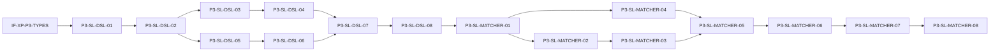

# P3: Pattern Engine

> **Control Plane**: This phase plan is designed for execution via the **ai-dev-kit** plugin.
> Use `/ai-dev-kit:execute-lane plans/P3-pattern-engine.md SL-DSL` to execute individual lanes.
> Use `/ai-dev-kit:execute-phase plans/P3-pattern-engine.md` to execute all lanes in dependency order.
>
> For specialized tasks, delegate to appropriate agents:
> - **Sandboxed execution**: `/ai-dev-kit:delegate codex "Build and test CypherCompiler"`
> - **Large context**: `/ai-dev-kit:delegate gemini "Review pattern matching edge cases"`

---

## Summary

Phase 3 implements the Pattern Engine for Semantic Lens:

1. **Pattern types** - Core type definitions for pattern detection
2. **YAML DSL parser** - Parse pattern definitions from YAML format
3. **Cypher compiler** - Compile pattern definitions to Cypher queries
4. **In-memory pattern matcher** - Match patterns using graph store queries
5. **Confidence scoring** - Calculate pattern match confidence scores
6. **Base pattern definitions** - Observer, Strategy, Factory, Singleton patterns

### What Ships

- `src/patterns/types.ts` - Pattern types and interfaces
- `src/patterns/dsl/parser.ts` - YAML DSL parser
- `src/patterns/cypher/compiler.ts` - Cypher query compiler
- `src/patterns/matcher/matcher.ts` - In-memory pattern matcher
- `src/patterns/scorer.ts` - Confidence scoring algorithm
- `src/patterns/definitions/*.yaml` - Base pattern definitions
- `src/patterns/index.ts` - Public API exports
- Test suite with >80% coverage on patterns module

---

## Interface Freeze Gates

### Core Interfaces (IF-0)

- [ ] IF-0-P3-TYPES: PatternDefinition, PatternMatch, RoleSpec, Constraint types frozen
- [ ] IF-0-P3-MATCHER: PatternMatcher interface frozen
- [ ] IF-0-P3-COMPILER: CypherCompiler interface frozen

### Cross-Phase Dependencies (IF-XP)

- [x] IF-XP-P3-STORE: GraphStore interface from Phase 2 (frozen)
- [x] IF-XP-P3-QUERY: NodeQuery, EdgeQuery from Phase 2 (frozen)
- [x] IF-XP-P3-TYPES: Node, Edge, PatternInstance from Phase 1 (frozen)
- [x] IF-XP-P3-CONSTANTS: NodeKind, EdgeKind from Phase 1 (frozen)

---

## Lane Index & Dependencies

```
- SL-DSL -- Pattern Types, DSL Parser & Cypher Compiler
  - Depends on: IF-XP-P3-TYPES, IF-XP-P3-CONSTANTS
  - Blocks: SL-MATCHER
  - Parallel-safe: yes

- SL-MATCHER -- In-Memory Matcher & Pattern Definitions
  - Depends on: IF-0-P3-TYPES, SL-DSL, IF-XP-P3-STORE
  - Blocks: None (Phase 4 depends on this)
  - Parallel-safe: no (depends on SL-DSL)
```

---

## A. Architectural Baseline & Component Catalog

### Files

| Path | Status | Purpose |
|------|--------|---------|
| `src/patterns/types.ts` | Added | Pattern types and interfaces |
| `src/patterns/dsl/parser.ts` | Added | YAML DSL parser |
| `src/patterns/cypher/compiler.ts` | Added | Cypher query compiler |
| `src/patterns/matcher/matcher.ts` | Added | In-memory pattern matcher |
| `src/patterns/scorer.ts` | Added | Confidence scoring algorithm |
| `src/patterns/index.ts` | Added | Public API exports |
| `src/patterns/definitions/observer.yaml` | Added | Observer pattern definition |
| `src/patterns/definitions/strategy.yaml` | Added | Strategy pattern definition |
| `src/patterns/definitions/factory.yaml` | Added | Factory pattern definition |
| `src/patterns/definitions/singleton.yaml` | Added | Singleton pattern definition |
| `tests/unit/patterns/types.test.ts` | Added | Type validation tests |
| `tests/unit/patterns/parser.test.ts` | Added | DSL parser tests |
| `tests/unit/patterns/compiler.test.ts` | Added | Cypher compiler tests |
| `tests/unit/patterns/matcher.test.ts` | Added | Matcher tests |
| `tests/unit/patterns/scorer.test.ts` | Added | Scorer tests |

### Classes and Types

| Name | Path | Status | Visibility |
|------|------|--------|------------|
| `PatternDefinition` | `src/patterns/types.ts` | Added | Public (interface) |
| `RoleSpec` | `src/patterns/types.ts` | Added | Public (interface) |
| `Constraint` | `src/patterns/types.ts` | Added | Public (type) |
| `EdgeConstraint` | `src/patterns/types.ts` | Added | Public (interface) |
| `GroupConstraint` | `src/patterns/types.ts` | Added | Public (interface) |
| `OptionalConstraint` | `src/patterns/types.ts` | Added | Public (interface) |
| `ScoringConfig` | `src/patterns/types.ts` | Added | Public (interface) |
| `PatternMatch` | `src/patterns/types.ts` | Added | Public (interface) |
| `DSLParser` | `src/patterns/dsl/parser.ts` | Added | Public (class) |
| `CypherCompiler` | `src/patterns/cypher/compiler.ts` | Added | Public (class) |
| `PatternMatcher` | `src/patterns/matcher/matcher.ts` | Added | Public (class) |
| `PatternScorer` | `src/patterns/scorer.ts` | Added | Public (class) |

### Functions and Methods

| Name | Path | Signature | Status |
|------|------|-----------|--------|
| `DSLParser.parse` | `src/patterns/dsl/parser.ts` | `(yaml: string) => PatternDefinition[]` | Added |
| `DSLParser.parseFile` | `src/patterns/dsl/parser.ts` | `(filePath: string) => Promise<PatternDefinition[]>` | Added |
| `DSLParser.validate` | `src/patterns/dsl/parser.ts` | `(definition: unknown) => ValidationResult` | Added |
| `CypherCompiler.compile` | `src/patterns/cypher/compiler.ts` | `(pattern: PatternDefinition) => string` | Added |
| `CypherCompiler.compileRoles` | `src/patterns/cypher/compiler.ts` | `(roles: Record<string, RoleSpec>) => string` | Added |
| `CypherCompiler.compileConstraints` | `src/patterns/cypher/compiler.ts` | `(constraints: Constraint[]) => string` | Added |
| `PatternMatcher.loadDefinitions` | `src/patterns/matcher/matcher.ts` | `(patterns: PatternDefinition[]) => void` | Added |
| `PatternMatcher.match` | `src/patterns/matcher/matcher.ts` | `(graph: GraphStore, scope?: string[]) => Promise<PatternMatch[]>` | Added |
| `PatternMatcher.matchPattern` | `src/patterns/matcher/matcher.ts` | `(graph: GraphStore, patternId: string) => Promise<PatternMatch[]>` | Added |
| `PatternScorer.calculateConfidence` | `src/patterns/scorer.ts` | `(pattern: PatternDefinition, bindings: RoleBindings, constraintResults: ConstraintResult[]) => number` | Added |
| `createPatternMatcher` | `src/patterns/matcher/matcher.ts` | `() => PatternMatcher` | Added |
| `loadBuiltinPatterns` | `src/patterns/index.ts` | `() => Promise<PatternDefinition[]>` | Added |

### Data Structures

| Name | Path | Fields | Status |
|------|------|--------|--------|
| `RoleSpec` | `src/patterns/types.ts` | `kind: NodeKind`, `owned_by?: string`, `name?: string \| RegExp` | Added |
| `EdgeConstraint` | `src/patterns/types.ts` | `type: 'edge'`, `kind: EdgeKind`, `from: string`, `to: string \| string[]`, `minConfidence?: number` | Added |
| `GroupConstraint` | `src/patterns/types.ts` | `type: 'group'`, `role: string`, `min_size: number`, `max_size?: number` | Added |
| `OptionalConstraint` | `src/patterns/types.ts` | `type: 'optional'`, `constraint: Constraint`, `bind_as?: string` | Added |
| `ScoringConfig` | `src/patterns/types.ts` | `base: number`, `weights: Record<string, number>` | Added |
| `PatternMatch` | `src/patterns/types.ts` | `instanceId: string`, `patternId: string`, `roles: Record<string, string \| string[]>`, `confidence: number`, `evidence: string[]`, `explain?: string` | Added |
| `RoleBindings` | `src/patterns/types.ts` | `Record<string, string \| string[]>` | Added |
| `ConstraintResult` | `src/patterns/types.ts` | `constraint: Constraint`, `satisfied: boolean`, `weight: number` | Added |

---

## B. Code-Level Interface Contracts

### PatternDefinition Types (IF-0-P3-TYPES)

**Defining file**: `src/patterns/types.ts`
**Owning component**: SL-DSL
**Expected consumers**: SL-MATCHER, Phase 4 (ViewService)

```typescript
/**
 * Specification for a role in a pattern.
 * Defines what kind of node can fill this role.
 */
export interface RoleSpec {
  /** Required node kind */
  kind: NodeKind;
  /** Role this node must be owned by (via DEFINES edge) */
  owned_by?: string;
  /** Name pattern to match */
  name?: string | RegExp;
  /** Additional node query criteria */
  query?: Partial<NodeQuery>;
}

/**
 * Edge constraint - requires an edge between roles.
 */
export interface EdgeConstraint {
  type: 'edge';
  /** Edge kind required */
  kind: EdgeKind;
  /** Source role name */
  from: string;
  /** Target role name(s) */
  to: string | string[];
  /** Minimum confidence for the edge */
  minConfidence?: number;
}

/**
 * Group constraint - requires multiple nodes filling a role.
 */
export interface GroupConstraint {
  type: 'group';
  /** Role name to constrain */
  role: string;
  /** Minimum number of nodes */
  min_size: number;
  /** Maximum number of nodes (optional) */
  max_size?: number;
}

/**
 * Optional constraint - adds to score if satisfied but not required.
 */
export interface OptionalConstraint {
  type: 'optional';
  /** The constraint to optionally satisfy */
  constraint: EdgeConstraint | GroupConstraint;
  /** Bind result to a role name */
  bind_as?: string;
}

/**
 * Union of all constraint types.
 */
export type Constraint = EdgeConstraint | GroupConstraint | OptionalConstraint;

/**
 * Scoring configuration for a pattern.
 */
export interface ScoringConfig {
  /** Base confidence score (0-1) */
  base: number;
  /** Weight for each constraint (0-1, must sum to <= 1-base) */
  weights: Record<string, number>;
}

/**
 * Full pattern definition.
 */
export interface PatternDefinition {
  /** Unique pattern identifier */
  id: string;
  /** Human-readable pattern name */
  name?: string;
  /** Pattern description */
  description?: string;
  /** Role definitions */
  roles: Record<string, RoleSpec>;
  /** Constraints between roles */
  constraints: Constraint[];
  /** Scoring configuration */
  scoring: ScoringConfig;
}
```

### PatternMatch Result (IF-0-P3-TYPES)

**Defining file**: `src/patterns/types.ts`

```typescript
/**
 * A detected pattern instance.
 */
export interface PatternMatch {
  /** Unique instance ID (generated) */
  instanceId: string;
  /** Pattern definition ID */
  patternId: string;
  /** Role bindings (role name -> node ID or array of node IDs) */
  roles: Record<string, string | string[]>;
  /** Confidence score (0-1) */
  confidence: number;
  /** Evidence for the match */
  evidence: string[];
  /** Human-readable explanation */
  explain?: string;
}
```

### PatternMatcher Interface (IF-0-P3-MATCHER)

**Defining file**: `src/patterns/matcher/matcher.ts`
**Owning component**: SL-MATCHER
**Expected consumers**: Phase 4 (ViewService), Phase 5 (UI)

```typescript
/**
 * Interface for pattern matching operations.
 */
export interface PatternMatcher {
  /**
   * Load pattern definitions for matching.
   * @param patterns - Array of pattern definitions
   */
  loadDefinitions(patterns: PatternDefinition[]): void;

  /**
   * Get all loaded pattern definitions.
   */
  getDefinitions(): PatternDefinition[];

  /**
   * Match all loaded patterns against a graph.
   * @param graph - GraphStore to match against
   * @param scope - Optional array of node IDs to limit scope
   * @returns Array of pattern matches
   */
  match(graph: GraphStore, scope?: string[]): Promise<PatternMatch[]>;

  /**
   * Match a specific pattern against a graph.
   * @param graph - GraphStore to match against
   * @param patternId - ID of pattern to match
   * @returns Array of pattern matches for this pattern
   */
  matchPattern(graph: GraphStore, patternId: string): Promise<PatternMatch[]>;
}
```

### CypherCompiler Interface (IF-0-P3-COMPILER)

**Defining file**: `src/patterns/cypher/compiler.ts`
**Owning component**: SL-DSL
**Expected consumers**: External Memgraph integration

```typescript
/**
 * Interface for Cypher query compilation.
 */
export interface CypherCompiler {
  /**
   * Compile a pattern definition to a Cypher query.
   * @param pattern - Pattern definition to compile
   * @returns Cypher query string
   */
  compile(pattern: PatternDefinition): string;
}
```

---

## C. Exhaustive Change List

| Path | Status | Owner | Rationale | Dependencies |
|------|--------|-------|-----------|--------------|
| `src/patterns/types.ts` | Added | SL-DSL | Core type definitions for patterns | IF-XP-P3-TYPES, IF-XP-P3-CONSTANTS |
| `src/patterns/dsl/parser.ts` | Added | SL-DSL | Parse YAML pattern definitions | IF-0-P3-TYPES |
| `src/patterns/cypher/compiler.ts` | Added | SL-DSL | Compile patterns to Cypher queries | IF-0-P3-TYPES |
| `src/patterns/matcher/matcher.ts` | Added | SL-MATCHER | In-memory pattern matching | IF-0-P3-TYPES, IF-XP-P3-STORE |
| `src/patterns/scorer.ts` | Added | SL-MATCHER | Confidence scoring | IF-0-P3-TYPES |
| `src/patterns/index.ts` | Added | SL-DSL | Public API exports | All pattern files |
| `src/patterns/definitions/observer.yaml` | Added | SL-MATCHER | Observer pattern definition | None |
| `src/patterns/definitions/strategy.yaml` | Added | SL-MATCHER | Strategy pattern definition | None |
| `src/patterns/definitions/factory.yaml` | Added | SL-MATCHER | Factory pattern definition | None |
| `src/patterns/definitions/singleton.yaml` | Added | SL-MATCHER | Singleton pattern definition | None |
| `tests/unit/patterns/types.test.ts` | Added | SL-DSL | Type validation tests | IF-0-P3-TYPES |
| `tests/unit/patterns/parser.test.ts` | Added | SL-DSL | DSL parser tests | SL-DSL |
| `tests/unit/patterns/compiler.test.ts` | Added | SL-DSL | Cypher compiler tests | SL-DSL |
| `tests/unit/patterns/matcher.test.ts` | Added | SL-MATCHER | Matcher tests | SL-MATCHER |
| `tests/unit/patterns/scorer.test.ts` | Added | SL-MATCHER | Scorer tests | SL-MATCHER |

---

## D. Swim Lanes

### SL-DSL -- Pattern Types, DSL Parser & Cypher Compiler

**Scope**:
- Define pattern-related types and interfaces
- Implement YAML DSL parser for pattern definitions
- Implement Cypher query compiler

**Owned files**:
- `src/patterns/types.ts`
- `src/patterns/dsl/parser.ts`
- `src/patterns/cypher/compiler.ts`
- `src/patterns/index.ts`
- `tests/unit/patterns/types.test.ts`
- `tests/unit/patterns/parser.test.ts`
- `tests/unit/patterns/compiler.test.ts`

**Interfaces provided**:
- `PatternDefinition`, `RoleSpec`, `Constraint`, `ScoringConfig` types (src/patterns/types.ts)
- `PatternMatch`, `RoleBindings`, `ConstraintResult` types (src/patterns/types.ts)
- `DSLParser` class (src/patterns/dsl/parser.ts)
- `CypherCompiler` class (src/patterns/cypher/compiler.ts)

**Interfaces consumed**:
- `NodeKind`, `EdgeKind` from `src/constants.ts`
- `Node`, `Edge`, `PatternInstance` from `src/schema/types.ts`

**Tasks**:

| Task ID | Task Type | Depends On | Files in Scope | Tests Owned Files | Test Command(s) | Acceptance Criteria |
|---------|-----------|------------|----------------|-------------------|-----------------|---------------------|
| P3-SL-DSL-01 | test | IF-XP-P3-TYPES | - | `tests/unit/patterns/types.test.ts` | `npm test -- tests/unit/patterns/types.test.ts` | Type validation tests defined for all pattern types |
| P3-SL-DSL-02 | impl | P3-SL-DSL-01 | `src/patterns/types.ts` | `tests/unit/patterns/types.test.ts` | `npm test -- tests/unit/patterns/types.test.ts` | Pattern types compile and pass validation tests |
| P3-SL-DSL-03 | test | P3-SL-DSL-02 | - | `tests/unit/patterns/parser.test.ts` | `npm test -- tests/unit/patterns/parser.test.ts` | Tests for DSL parsing including valid/invalid YAML |
| P3-SL-DSL-04 | impl | P3-SL-DSL-03 | `src/patterns/dsl/parser.ts` | `tests/unit/patterns/parser.test.ts` | `npm test -- tests/unit/patterns/parser.test.ts` | Parser correctly parses all spec examples |
| P3-SL-DSL-05 | test | P3-SL-DSL-02 | - | `tests/unit/patterns/compiler.test.ts` | `npm test -- tests/unit/patterns/compiler.test.ts` | Tests for Cypher compilation of all constraint types |
| P3-SL-DSL-06 | impl | P3-SL-DSL-05 | `src/patterns/cypher/compiler.ts` | `tests/unit/patterns/compiler.test.ts` | `npm test -- tests/unit/patterns/compiler.test.ts` | Compiler generates valid Cypher for all patterns |
| P3-SL-DSL-07 | impl | P3-SL-DSL-04, P3-SL-DSL-06 | `src/patterns/index.ts` | - | `npm run build` | Public exports compile and are importable |
| P3-SL-DSL-08 | verify | P3-SL-DSL-07 | - | - | `npm test -- tests/unit/patterns/types.test.ts tests/unit/patterns/parser.test.ts tests/unit/patterns/compiler.test.ts` | All SL-DSL tests pass |

---

### SL-MATCHER -- In-Memory Matcher & Pattern Definitions

**Scope**:
- Implement in-memory pattern matching using graph store queries
- Implement confidence scoring algorithm
- Create base pattern definitions (Observer, Strategy, Factory, Singleton)

**Owned files**:
- `src/patterns/matcher/matcher.ts`
- `src/patterns/scorer.ts`
- `src/patterns/definitions/observer.yaml`
- `src/patterns/definitions/strategy.yaml`
- `src/patterns/definitions/factory.yaml`
- `src/patterns/definitions/singleton.yaml`
- `tests/unit/patterns/matcher.test.ts`
- `tests/unit/patterns/scorer.test.ts`

**Interfaces provided**:
- `PatternMatcher` class (src/patterns/matcher/matcher.ts)
- `PatternScorer` class (src/patterns/scorer.ts)
- `createPatternMatcher()` factory (src/patterns/matcher/matcher.ts)
- `loadBuiltinPatterns()` utility (src/patterns/index.ts)

**Interfaces consumed**:
- `PatternDefinition`, `PatternMatch`, `Constraint` from `src/patterns/types.ts`
- `GraphStore`, `NodeQuery`, `EdgeQuery` from `src/graph/store.ts`
- `Node`, `Edge` from `src/schema/types.ts`

**Tasks**:

| Task ID | Task Type | Depends On | Files in Scope | Tests Owned Files | Test Command(s) | Acceptance Criteria |
|---------|-----------|------------|----------------|-------------------|-----------------|---------------------|
| P3-SL-MATCHER-01 | impl | SL-DSL | `src/patterns/definitions/*.yaml` | - | - | Valid pattern definitions for Observer, Strategy, Factory, Singleton |
| P3-SL-MATCHER-02 | test | P3-SL-MATCHER-01 | - | `tests/unit/patterns/scorer.test.ts` | `npm test -- tests/unit/patterns/scorer.test.ts` | Tests for confidence scoring with various constraint results |
| P3-SL-MATCHER-03 | impl | P3-SL-MATCHER-02 | `src/patterns/scorer.ts` | `tests/unit/patterns/scorer.test.ts` | `npm test -- tests/unit/patterns/scorer.test.ts` | Scorer calculates correct confidence values |
| P3-SL-MATCHER-04 | test | P3-SL-MATCHER-01, IF-XP-P3-STORE | - | `tests/unit/patterns/matcher.test.ts` | `npm test -- tests/unit/patterns/matcher.test.ts` | Tests for pattern matching with known patterns |
| P3-SL-MATCHER-05 | impl | P3-SL-MATCHER-04, P3-SL-MATCHER-03 | `src/patterns/matcher/matcher.ts` | `tests/unit/patterns/matcher.test.ts` | `npm test -- tests/unit/patterns/matcher.test.ts` | Matcher detects patterns in test graph |
| P3-SL-MATCHER-06 | impl | P3-SL-MATCHER-05 | `src/patterns/index.ts` | - | `npm run build` | loadBuiltinPatterns works correctly |
| P3-SL-MATCHER-07 | verify | P3-SL-MATCHER-06 | - | - | `npm test -- tests/unit/patterns/ --coverage` | All tests pass, >80% coverage on patterns module |
| P3-SL-MATCHER-08 | verify | P3-SL-MATCHER-07 | - | - | `npm run build` | Build succeeds with no type errors |

---

## E. Execution Notes

### Parallelism

- **SL-DSL** can start immediately after IF-XP gates are verified
- **SL-MATCHER** must wait for IF-0-P3-TYPES (SL-DSL completion)
- SL-DSL tasks P3-SL-DSL-03/04 and P3-SL-DSL-05/06 can run in parallel (parser vs compiler)

### Serialization Points

1. **IF-0-P3-TYPES freeze**: Before SL-MATCHER begins, pattern types must be frozen
2. **SL-DSL-07**: Index exports must be updated after parser and compiler are complete
3. **SL-MATCHER-06**: Index must be updated with loadBuiltinPatterns after matcher is complete

### Critical Path



### First Deliverable to Unblock

The `src/patterns/types.ts` file with pattern type definitions is the first file needed. All other work depends on these types being stable.

---

## F. File-by-File Specification

### `src/patterns/types.ts` -- Added -- Owner: SL-DSL

**Purpose**: Define all types and interfaces for the pattern engine.

**Key responsibilities**:
- Define RoleSpec for role specifications
- Define Constraint union type (EdgeConstraint, GroupConstraint, OptionalConstraint)
- Define ScoringConfig for pattern scoring
- Define PatternDefinition for full pattern specs
- Define PatternMatch for detection results
- Define helper types (RoleBindings, ConstraintResult)

**Interfaces exposed**:
- All pattern types as listed in Section B

**Tests required**:
- Type guard functions work correctly
- Invalid type shapes are rejected
- Default values are applied correctly

---

### `src/patterns/dsl/parser.ts` -- Added -- Owner: SL-DSL

**Purpose**: Parse YAML pattern definitions into PatternDefinition objects.

**Key responsibilities**:
- Parse YAML string to PatternDefinition array
- Validate parsed definitions against schema
- Handle regex patterns in name fields
- Provide clear error messages for invalid YAML
- Support loading from file path

**Interfaces exposed**:
- `DSLParser` class with `parse()`, `parseFile()`, `validate()` methods

**Tests required**:
- Parse valid YAML with all constraint types
- Reject invalid YAML with clear errors
- Handle empty/missing fields correctly
- Parse all spec examples correctly

---

### `src/patterns/cypher/compiler.ts` -- Added -- Owner: SL-DSL

**Purpose**: Compile PatternDefinition to Cypher queries for Memgraph/Neo4j.

**Key responsibilities**:
- Generate MATCH clauses from role specs
- Generate WHERE/WITH clauses from constraints
- Handle OPTIONAL MATCH for optional constraints
- Generate scoring expressions
- Produce valid, executable Cypher

**Interfaces exposed**:
- `CypherCompiler` class with `compile()` method

**Tests required**:
- Compile Observer pattern to valid Cypher
- Compile Strategy pattern to valid Cypher
- Compile Factory pattern to valid Cypher
- Compile Singleton pattern to valid Cypher
- Handle all constraint types correctly

---

### `src/patterns/matcher/matcher.ts` -- Added -- Owner: SL-MATCHER

**Purpose**: In-memory pattern matching using GraphStore queries.

**Key responsibilities**:
- Load and store pattern definitions
- Find candidate nodes for each role
- Check constraints between role bindings
- Generate all valid role binding combinations
- Call scorer for confidence calculation
- Return PatternMatch results with evidence

**Interfaces exposed**:
- `PatternMatcher` class implementing the PatternMatcher interface
- `createPatternMatcher()` factory function

**Tests required**:
- Detect Observer pattern in test graph
- Detect Strategy pattern in test graph
- Detect Factory pattern in test graph
- Detect Singleton pattern in test graph
- Handle no matches gracefully
- Performance: <500ms for 1000-node graph

---

### `src/patterns/scorer.ts` -- Added -- Owner: SL-MATCHER

**Purpose**: Calculate confidence scores for pattern matches.

**Key responsibilities**:
- Apply base score from ScoringConfig
- Add weighted scores for satisfied constraints
- Handle optional constraints correctly
- Normalize scores to 0-1 range
- Generate evidence strings

**Interfaces exposed**:
- `PatternScorer` class with `calculateConfidence()` method

**Tests required**:
- Base score applied correctly
- Weights sum correctly
- Optional constraints add to score when satisfied
- Score never exceeds 1.0
- Evidence strings are meaningful

---

### `src/patterns/index.ts` -- Added -- Owner: SL-DSL

**Purpose**: Public API exports for the patterns module.

**Key responsibilities**:
- Re-export all public types
- Re-export parser, compiler, matcher, scorer
- Provide loadBuiltinPatterns() utility
- Export factory functions

**Interfaces exposed**:
- All public exports from types.ts, parser.ts, compiler.ts, matcher.ts, scorer.ts
- `loadBuiltinPatterns()` function

**Tests required**:
- None (export correctness verified by TypeScript)

---

### `src/patterns/definitions/observer.yaml` -- Added -- Owner: SL-MATCHER

**Purpose**: Define the Observer pattern in YAML DSL.

**Content**:
- Roles: subject (class), notify (method), observer (class), update (method)
- Constraints: notify calls update, multiple observers, optional common base
- Scoring: base 0.4, calls_notify_update 0.3, multiple_observers 0.2, has_observer_base 0.1

---

### `src/patterns/definitions/strategy.yaml` -- Added -- Owner: SL-MATCHER

**Purpose**: Define the Strategy pattern in YAML DSL.

**Content**:
- Roles: context (class), strategy_interface (interface), strategy_impl (class)
- Constraints: context uses interface, multiple implementations
- Scoring: base 0.4, uses_interface 0.3, multiple_impls 0.3

---

### `src/patterns/definitions/factory.yaml` -- Added -- Owner: SL-MATCHER

**Purpose**: Define the Factory Method pattern in YAML DSL.

**Content**:
- Roles: creator (class), factory_method (method), product_base (interface/class), product (class)
- Constraints: factory method calls constructors, multiple products share base
- Scoring: base 0.3, factory_method 0.3, multiple_products 0.3, shared_base 0.1

---

### `src/patterns/definitions/singleton.yaml` -- Added -- Owner: SL-MATCHER

**Purpose**: Define the Singleton pattern in YAML DSL.

**Content**:
- Roles: singleton_class (class), accessor (method), instance_field (field)
- Constraints: accessor reads/writes instance field, method name contains 'instance'
- Scoring: base 0.5, has_accessor 0.25, has_instance_field 0.25

---

## H. Test Execution Plan

### Test Commands by Lane

**SL-DSL**:
```bash
# Type tests
npm test -- tests/unit/patterns/types.test.ts

# Parser tests
npm test -- tests/unit/patterns/parser.test.ts

# Compiler tests
npm test -- tests/unit/patterns/compiler.test.ts

# All SL-DSL tests
npm test -- tests/unit/patterns/types.test.ts tests/unit/patterns/parser.test.ts tests/unit/patterns/compiler.test.ts
```

**SL-MATCHER**:
```bash
# Scorer tests
npm test -- tests/unit/patterns/scorer.test.ts

# Matcher tests
npm test -- tests/unit/patterns/matcher.test.ts

# All SL-MATCHER tests
npm test -- tests/unit/patterns/scorer.test.ts tests/unit/patterns/matcher.test.ts
```

**Full Phase 3**:
```bash
# All pattern tests with coverage
npm test -- tests/unit/patterns/ --coverage

# Build verification
npm run build
```

### Ordering Constraints

1. Run SL-DSL tests before SL-MATCHER tests (SL-MATCHER depends on types)
2. Run scorer tests before matcher tests (matcher uses scorer)
3. Parser tests require yaml package to be installed

### Smoke vs Full Suite

**Smoke tests** (for quick verification):
```bash
npm test -- tests/unit/patterns/types.test.ts --testNamePattern="basic"
```

**Full suite** (for CI):
```bash
npm test -- tests/unit/patterns/ --coverage --coverageThreshold='{"lines":80}'
```

---

## J. Acceptance Criteria

| Criterion | Test Method | Pass Condition |
|-----------|-------------|----------------|
| Pattern types compile | `npm run build` | No TypeScript errors |
| DSL parser correctly parses all spec examples | `npm test -- tests/unit/patterns/parser.test.ts` | All tests pass |
| Cypher compiler generates valid Cypher queries | `npm test -- tests/unit/patterns/compiler.test.ts` | Generated Cypher is syntactically valid |
| In-memory matcher produces same results as expected | `npm test -- tests/unit/patterns/matcher.test.ts` | Detected patterns match expected |
| Pattern detection runs in <500ms for 1000-node graphs | `npm test -- tests/unit/patterns/matcher.test.ts --testNamePattern="performance"` | Duration assertion passes |
| All 4 base patterns implemented | `ls src/patterns/definitions/` | observer.yaml, strategy.yaml, factory.yaml, singleton.yaml exist |
| Confidence scores are in valid range | `npm test -- tests/unit/patterns/scorer.test.ts` | All scores between 0 and 1 |
| Pattern module has >80% test coverage | `npm test -- tests/unit/patterns/ --coverage` | Coverage threshold met |
| Public exports are importable | `import { PatternMatcher, loadBuiltinPatterns } from './src/patterns'` | No import errors |

---

## Dependencies on Phase 2

This phase directly depends on the following Phase 2 artifacts:

### GraphStore (from `src/graph/store.ts`)
- `GraphStore` interface - Used by PatternMatcher for graph queries
- `NodeQuery`, `EdgeQuery` - Used for finding candidate nodes
- `SubgraphResult` - Used for scoped pattern matching

### Query Utilities (from `src/graph/queries.ts`)
- `getPath()` - May be used for path-based constraints
- `findByRoute()` - Used for finding nodes by route pattern

### Constants (from `src/constants.ts`)
- `NodeKind` - Used in RoleSpec definitions
- `EdgeKind` - Used in EdgeConstraint definitions

### Types (from `src/schema/types.ts`)
- `Node`, `Edge` - Core graph element types
- `PatternInstance` - For storing detected patterns

### Test Fixtures (from `fixtures/sample-graphs/`)
- `pattern-rich.json` - Graph with known patterns for testing

All Phase 2 interfaces are frozen and stable for Phase 3 consumption.

---

_Generated by `/ai-dev-kit:plan-phase` for Phase 3: Pattern Engine_
